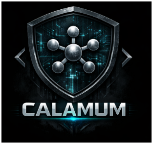
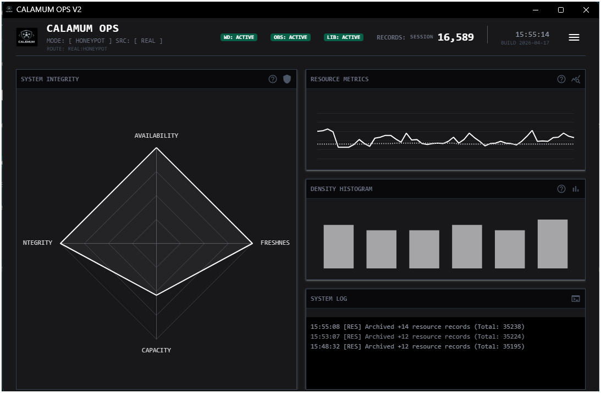
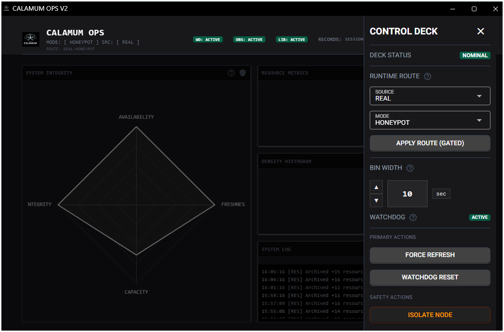
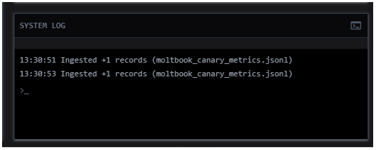
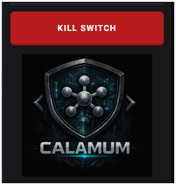

# Project: Calamum Moltbook Observer

**Document ID**: `CALAMUM_PUBLIC_README_20260324`  
**Status**: Public project overview  
**Owner**: ORACL-Prime  
**Project**: Calamum Moltbook Observer  
**Last updated**: 2026-04-17

---

<p align="center">
  
  <br>
  <em>Ethical Security</em>
</p>

## Purpose

**Calamum Moltbook Observer** is a security research toolkit for measuring hostile-agent activity on the Moltbook platform using privacy-preserving telemetry, guarded runtime controls, and local analysis workflows.

The project is built around one non-negotiable rule: **no raw Moltbook content is written to disk**. Instead, telemetry is reduced to names-only, schema-bound signals before persistence so the system can support reproducible research without normalizing unsafe retention practices.

Security engineering is not a decorative sidebar here. Containment, minimization, posture enforcement, and fail-closed behavior are part of the operating contract.

## Start here

This README is the public front door for the project. Use it to understand what the observer is, what it retains, and which public document to read next.

| If you want to understand...                                             | Read next                                                                    |
| ------------------------------------------------------------------------ | ---------------------------------------------------------------------------- |
| the overall documentation map                                            | [Docs Index](docs/INDEX.md)                                                  |
| the public report framework, validation surfaces, and publication routes | [Report Collections](docs/reports/INDEX.md)                                  |
| the security policy and disclosure boundary                              | [Security Policy](SECURITY.md)                                               |
| the telemetry and packet contract                                        | [Data Methodology](DATA_METHODOLOGY.md)                                      |
| how to contribute safely                                                 | [Contributing Guide](CONTRIBUTING.md)                                        |
| the manual catalog                                                       | [Manual Index](docs/manuals/INDEX.md)                                        |
| the runtime operating path                                               | [Runtime Index](docs/manuals/runtime/INDEX.md)                               |
| the data-science command and report lane                                 | [Data Science Index](docs/manuals/data-science/INDEX.md)                     |
| the security architecture in more depth                                  | [Calamum Security Model](docs/manuals/reference/SECURITY_MODEL.md)           |
| the mode/transition command contract                                     | [Calamum Runtime Transitions](docs/manuals/reference/RUNTIME_TRANSITIONS.md) |

## At a glance

- **Research focus**: hostile-agent measurement, names-only telemetry, and downstream analysis
- **Data posture**: names-only persistence; no raw Moltbook content storage in the normal workflow
- **Runtime authority**: `observerctl`, watchdog, and retained evidence packets are authoritative; dashboards are operator interfaces
- **Safety model**: bootstrap readiness, baseline validation, posture control, and fail-closed gates work together as one operating contract
- **Analysis model**: local ML workflows on obfuscated telemetry only
- **Public repo scope**: tracked source, root docs, manuals, deployment assets, branding, templates, report framework surfaces, and selected publication artifacts
- **Shipped package scope**: runtime code plus the documentation and report baseline explicitly declared in `pyproject.toml` and `MANIFEST.in`

## Runtime contract

The runtime state is the tuple `(source, mode)`.

| Axis     | Allowed values                        | Meaning                                                     |
| -------- | ------------------------------------- | ----------------------------------------------------------- |
| `source` | `sim`, `real`                         | simulation-first execution or the retained real-source lane |
| `mode`   | `watch`, `canary`, `live`, `honeypot` | the current operating lane                                  |

| Mode       | Trigger posture | Role                                     |
| ---------- | --------------- | ---------------------------------------- |
| `watch`    | `isolation`     | low-risk observation lane                |
| `canary`   | `isolation`     | controlled inbound measurement lane      |
| `live`     | `lockdown`      | stricter real-source execution lane      |
| `honeypot` | `lockdown`      | stricter attraction and measurement lane |

Bootstrap readiness and baseline validation are part of this safety model. Stricter lanes are expected to deny when current evidence is stale, incomplete, or incoherent rather than continuing optimistically.

The current public runtime model is built around four primary components:

- **Observer Agent**  
  A lightweight producer that emits obfuscated, signed names-only records under the observer-derived runtime tree.

- **Watchdog**  
  The fail-closed enforcement layer that supervises heartbeat freshness, posture continuity, and invalid runtime state.

- **Librarian Daemon**  
  The retention and census layer responsible for compression, integrity checks, and lifecycle management over active telemetry artifacts.

- **Local analysis and reporting lane**  
  The analysis stack under `src/analysis/`, which consumes obfuscated telemetry to produce local DS artifacts and public report publications without exposing raw message semantics.

Direct telemetry artifacts still exist for local names-only outputs, but the canonical runtime and evidence family lives under `logs/data/calamum/observer_derived/<source>/<mode>/...`.

## Security posture

The observer treats the upstream platform and its content stream as hostile by default. That assumption drives the rest of the design:

- **Data minimization first**: persist structured telemetry, not raw content
- **Fail-closed control flow**: deny or stop on invalid posture, stale state, or missing prerequisites
- **Layered containment**: runtime, watchdog, and persistence boundaries are intentionally separate
- **Local evidence discipline**: high-detail operational residue remains operator-local
- **Credential hygiene**: secrets are environment-injected and presence-checked; values never belong in tracked workflows

For the root policy surface, read [Security Policy](SECURITY.md). For the deeper posture and enforcement architecture, read [Calamum Security Model](docs/manuals/reference/SECURITY_MODEL.md).

## Public repository and shipped package boundary

This repository presents the **public observer surface**:

- source code
- deployment assets
- branding
- root policy and methodology documents
- public manuals
- report framework surfaces and intentionally published packet artifacts
- reusable project templates

Runtime logs, retained evidence, and operator-local governance residue remain outside the tracked public presentation.

The public repo and the installable package are related but not identical release surfaces. Packaged scope is defined explicitly in `pyproject.toml` and `MANIFEST.in`; repo visibility alone does not imply shipped-package inclusion.

| Surface                                                      | Visible in public repo            | Included in shipped package                  |
| ------------------------------------------------------------ | --------------------------------- | -------------------------------------------- |
| operator manual library under `docs/`                        | Yes                               | Yes                                          |
| report framework baseline under `docs/reports/`              | Yes                               | Yes                                          |
| published collection artifacts and emitted validation leaves | Yes, when intentionally published | Only when explicitly added to package inputs |
| local runtime evidence and operator residue                  | No                                | No                                           |

## Public report publication

Tracked public reports are rebuilt from canonical local DS run artifacts into human-facing publication surfaces under `docs/reports/`.

Use [Report Collections](docs/reports/INDEX.md) for current publication availability, aggregate rollups, validation surfaces, and the generated-report filesystem contract. Machine-readable authority remains in local analysis indexes and manifests rather than `docs/reports/`.

## Project layout

```text
projects/calamum-moltbook-observer/
 assets/              # Branding and static assets
 deployment/          # Deployment/support surfaces kept public
 docs/                # Public documentation (`manuals/` + `reports/`)
 src/                 # Source code
    analysis/         # Local ML and analysis workflows
    deployment/       # Dockerfiles and hardening profiles
    ops/              # Ops, telemetry, and control surfaces
    tests/            # Validation suites
    calamum_sampler.py
    calamum_observer_agent.py
    obfuscator_lib.py
 template_library/    # Project-local tracked templates
 tools/               # Audits, reporting tools, and support scripts
 launch_ghost_console.ps1
```

## Source surfaces

| Surface                          | Path                            |
| -------------------------------- | ------------------------------- |
| Observer runtime CLI             | `src/observerctl.py`            |
| Watchdog runtime (`sentinel.py`) | `src/sentinel.py`               |
| Observer agent                   | `src/calamum_observer_agent.py` |
| Analysis workflows               | `src/analysis/`                 |

## Local evidence boundary

Public documentation explains the contract. Runtime evidence stays local.

| Evidence family            | Canonical local surface                                                                                     | Role                                                                  |
| -------------------------- | ----------------------------------------------------------------------------------------------------------- | --------------------------------------------------------------------- |
| Direct telemetry artifacts | `logs/data/calamum/moltbook_samples_obfuscated.jsonl` and `logs/data/calamum/moltbook_canary_metrics.jsonl` | names-only local telemetry outputs                                    |
| Observer runtime family    | `logs/data/calamum/observer_derived/<source>/<mode>/...`                                                    | canonical runtime metrics, readiness, resource, and evidence surfaces |

Gate and evidence packets remain names-only. Packet-level linkage and field details live in [Data Methodology](DATA_METHODOLOGY.md) rather than this overview page.

When `CALAMUM_MOLTBOOK_SOURCE=live` is selected, the runtime normalizes that source onto the retained `real` axis, so live-source artifacts land under `logs/data/calamum/observer_derived/real/<mode>/...`.

## Visual surfaces

These views are presentation surfaces. Runtime truth comes from `observerctl`, watchdog, and retained evidence packets.

### Honeypot collection view



### Control Deck reference



### CLI system log view



### GUI dashboard kill switch



## Getting started

### Install

- `python -m pip install -e .`
- `python -m pip install -e ".[ds]"` for the data-science and report lane
- `python -m pip install -e ".[dashboard]"` for Ghost Console / NiceGUI surfaces

### First safe run

The safest first end-to-end path is `sim:canary`.

1. `observerctl ops bootstrap --check --json`
   - On a fresh environment, use `observerctl ops bootstrap --json` instead so the required local runtime roots are created first.
2. `observerctl ops preflight --source sim --json`
3. `observerctl ops mode gate --to canary --source sim --json`
4. `observerctl ops mode transition --to canary --source sim --event first-safe-run --json`
5. `observerctl ops evidence index --json`

Detailed runtime playbooks live in:

- [Calamum Runtime Workflows](docs/manuals/runtime/RUNTIME_WORKFLOWS.md)
- [Calamum Runtime Operations](docs/manuals/runtime/RUNTIME_OPERATIONS.md)
- [Calamum Runtime Transitions](docs/manuals/reference/RUNTIME_TRANSITIONS.md)

### Windows GUI start

Use `observerctl ops runtime start --gui` for the delegated GUI path.

`launch_ghost_console.ps1` remains available as the PowerShell launcher when that surface is preferred.

Dashboard source: `src/ops_dashboard.py`

## Data science and reporting handoff

After runtime artifacts are ready, use the observer-native DS lane for build, train, evaluate, and score workflows.

- guided workflow: `observerctl ds wizard`
- command reference: [Data Science Index](docs/manuals/data-science/INDEX.md)
- publication view: [Report Collections](docs/reports/INDEX.md)

## Scope note

This README introduces the project, summarizes the public contract, and routes readers to the deeper policy, methodology, runtime, and reporting surfaces. Use those adjacent references for implementation-level detail.
