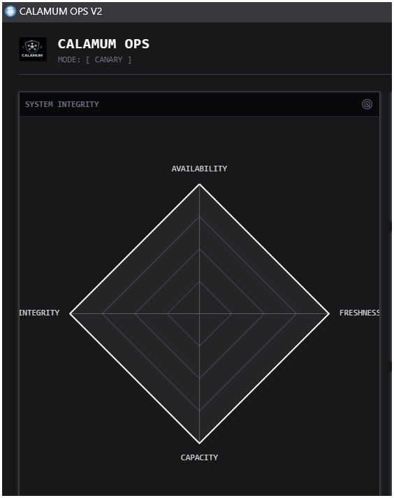

# Project: Calamum Moltbook Observer

> **Managed by CodeSentinel** | *Ethical Security Research Initiative*

**Owner**: ORACL-Prime  
**Status**: Active (Phase 5: Model Training Enabled)  
**Created**: 2026-02-01  
**Last Update**: 2026-02-10 (v1.2.0)

---

## Executive Summary

The **Moltbook Observer** project is a security research initiative designed to measure the density of hostile agent activity on the Moltbook platform. The experiment operates through a series of escalating "Observer Stages," ranging from purely passive sampling (Stage 1) to active honeypots (Stage 4) and machine learning analysis (Phase 5).

**Key Constraint**: The observer must remain invisible and secure. It employs "Obfuscation at the Edge" to ensure no raw content (potential prompt injection vectors or illegal content) ever touches the Observer's disk.

**Architecture v1.2.0**:
-   **Observer Agent**: Lightweight producer that streams obfuscated, signed records to `logs/data`. Rotates files atomically based on policy.
-   **Librarian Daemon**: Background process that compresses active logs, validates integrity, and effectively "trains" the Agent by updating the `rotation_policy.json` based on actual data density.
-   **Blind ML Pipeline**: Local training pipeline (`src/analysis/`) that consumes obfuscated logs to produce `scikit-learn` models (Random Forest, Isolation Forest) without exposing raw message semantics.

<p align="center">
  
  <br>
  <em>Secure / In-Memory / Ephemeral</em>
</p>

## Directory Structure

```text
projects/calamum-moltbook-observer/
├── jobs/               # Job Definitions (The "Why" & "How")
├── planning/           # Experiment Plans & Hypotheses
├── questframes/        # Specs for execution tracking
├── queststacks/        # Logs of execution history
├── src/                # Source Code (The "What")
│   ├── analysis/         # ML Models & Notebooks (Stage 4 Analysis)
│   ├── deployment/       # Dockerfiles & Hardening Profiles (Stage 2)
│   ├── ops/              # Ops/telemetry/control surfaces (Ghost Console V2)
│   ├── tests/            # Validation Scripts
│   ├── calamum_sampler.py # The Agent (Stage 1/3)
│   ├── calamum_observer_agent.py # Local demo agent (heartbeats + JSONL + signal consumer)
│   └── obfuscator_lib.py # Safety Layer (Stage 1/3)
├── launch_ghost_console.ps1 # Ghost Console V2 launcher (Edge app-mode)
└── REFERENCES.md       # Index of detailed artifact links
```

Note: Coursework write-ups and submission artifacts are maintained **locally** (not tracked in the public repository).

## Experiment Stages

| Stage | Name | Status | Description |
|-------|------|--------|-------------|
| **1** | **Observe & Sample** | **COMPLETE** | Read-only sampling of public feed. Validated `obfuscator_lib` safety. |
| **2** | **Container Hardening** | **COMPLETE** | Deployment of "Glass Box" read-only container environment. |
| **3** | **Passive Canary** | **COMPLETE** | Deployment of silent account to measure inbound "background radiation" (DMs/follows). |
| **4** | **Magnet (Honeypot)** | *PLANNED* | Active "Soft Target" deployment to attract hostile agents. |
| **5** | **Blind ML Analysis** | **ACTIVE** | Local training of supervised/unsupervised models on obfuscated telemetry. |

## Key Artifacts

### Documentation
- **Master Plan**: [Moltbook Observer Experiment Plan](planning/CALAMUM_MOLTBOOK_OBSERVER_EXPERIMENT_PLAN_20260201.md)
- **Operations Policy (CodeSentinel job execution)**: [Job Execution Expectations](docs/CALAMUM_CODESENTINEL_JOB_EXECUTION_EXPECTATIONS.md)
- **ML Gap Analysis**: [Model Training Implementation](planning/CALAMUM_MODEL_TRAINING_GAP_ANALYSIS_20260210.md)
- **Methodology**: [Data Simulation & Logging](DATA_METHODOLOGY.md)
- **Hardening Profile**: [Container Constraints](src/deployment/HARDENING_PROFILE.md)
- **Sentinel**: [Triple-Redundancy Watchdog](src/sentinel.py)

### Evidence (Logs)
- **Stage 1 (Public Sample)**: `logs/data/calamum/moltbook_samples_obfuscated.jsonl`
- **Stage 3 (Canary Metrics)**: `logs/data/calamum/moltbook_canary_metrics.jsonl`

## Visuals

### Operational Radar


### CLI Dashboard (deprecated TUI concept)


## Operation Manual

### Observer runtime CLI (`observerctl`)

Observer runtime operations are exposed through `src/observerctl.py` and are intentionally standalone from CodeSentinel runtime process surfaces.

Install native CLI entrypoint (one-time per environment):

- `python -m pip install -e .`

After installation, use the observer-native command surface directly:

- Preflight status packet (names-only):
  - `observerctl ops preflight --source sim --json`
- Gate decision packet (`go` / `no-go`):
  - `observerctl ops gate-check --source sim --json`
- Publication-grade evidence packet (provenance/methodology/process):
  - `observerctl ops evidence pack --source sim --json`
- Atomic transition workflow (gate + set + evidence):
  - `observerctl ops mode transition --to canary --source sim --event transition-canary --output local_untracked/observerctl/evidence/transition_canary.json --json`

Critical note: `ops gate-check` is fail-closed and returns non-zero when required inputs are missing (for example, no signing-key context).

### Launching (Windows Host)
#### A) Ghost Console V2 (Ops Dashboard)
The Ghost Console is a fixed-size, "digital brutalism" ops dashboard (NiceGUI + ECharts) designed to show **names-only** telemetry.

- **Start UI (recommended)**: run `projects/calamum-moltbook-observer/launch_ghost_console.ps1`
	- starts the backend hidden (no terminal window)
	- opens Microsoft Edge in app-mode at **1100×720**

**Dashboard source**: `src/ops_dashboard.py`

#### B) Observer + Watchdog (legacy/manual)
1. **Start Observer**: `./src/deployment/secure_run.ps1`
2. **Start Watchdog**: `python src/sentinel.py`

## Ghost Console V2: Data + Control Contracts

### Telemetry inputs (names-only)
The dashboard reads from:
- **CPU/MEM**: `psutil` (local host)
- **Observer liveness**: heartbeat marker freshness OR recent JSONL activity
- **Watchdog liveness**: watchdog heartbeat marker freshness
- **Records/Density**: append-only JSONL metrics (counts only)

Default locations (repo-root relative):
- `logs/health/calamum_ops_watchdog.heartbeat`
- `logs/health/calamum_observer.heartbeat`
- `logs/data/calamum/*.jsonl` (newest file is treated as active)

### Control surface (file-based intents)
Control Deck actions emit JSON control signals (safe for later container wiring):
- `logs/control/calamum/kill.signal.json`
- `logs/control/calamum/isolate.signal.json`
- `logs/control/calamum/refresh.signal.json`

**Doctrine**:
- The GUI is an interface/exhibition tool. It is not SSOT and no system behavior may depend on it.
- Watchdog is system-level governance and is always-on for the duration of active experimentation (24/7).
- If Watchdog is down, the node must remain isolated/quarantined until Watchdog returns via self-resilience recovery, or (if self-recovery fails) an operator/external agent performs an explicit recovery action.

### Local end-to-end demo agent
For local testing without a live container, `src/calamum_observer_agent.py` can:
- touch heartbeat files
- append JSONL records
- consume/acknowledge control signals

**Doctrine alignment note (2026-02-15):**
- The above local demo lane is telemetry simulation only and is **not** authorized for Moltbook-facing collection.
- Any Moltbook-facing observer execution is container-only per `docs/CALAMUM_CODESENTINEL_JOB_EXECUTION_EXPECTATIONS.md`.

## Environment variables (optional overrides)
- `CALAMUM_OPS_MODE`: dashboard mode label (normalized; defaults to `CANARY`)
- `CALAMUM_FRESHNESS_SEC`: heartbeat freshness threshold (default: `15`)
- `CALAMUM_WATCHDOG_HEARTBEAT_PATH`: path to watchdog heartbeat marker
- `CALAMUM_OBSERVER_HEARTBEAT_PATH`: path to observer heartbeat marker
- `CALAMUM_DATA_DIR`: directory containing JSONL metrics
- `CALAMUM_DENSITY_SLICE_SEC`: histogram time-slice width (default: `15`)
- `CALAMUM_MOLTBOOK_SOURCE`: observer agent source selector (`sim` or `real`; default: `sim`)
- `MOLTBOOK_API_KEY`: required for live collection (presence-only; never commit values). For key acquisition and handling doctrine, see: [Job Execution Expectations](docs/CALAMUM_CODESENTINEL_JOB_EXECUTION_EXPECTATIONS.md)
- `MOLTBOOK_HOST`: optional override for the Moltbook API base URL (default: `https://api.moltbook.com/v1`)
- `CALAMUM_LIVE_BATCH_LIMIT`: live feed batch size cap (default: `50`; clamped)
- `CALAMUM_LIVE_EMPTY_BACKOFF_SEC`: backoff time when live fetch yields zero items (default: `10`)
- `CALAMUM_BRAND_THUMB_PATH`, `CALAMUM_BRAND_PANEL_PATH`: optional branding asset overrides

## Academic Reproducibility

This project maintains rigorous separation between:
1.  **Intent** (Jobs/Planning): Why we are doing this.
2.  **Mechanism** (Src): The code executed.
3.  **Observation** (Logs): The raw data (with PII hashed).

See `docs/reports/operations/` for narrative reports on methodology.

## Live collection contract (names-only)

When `CALAMUM_MOLTBOOK_SOURCE=live` and `CALAMUM_OPS_MODE` is not `CANARY`, the observer agent writes the canonical live metrics stream:

- `logs/data/calamum/moltbook_live_metrics.jsonl`

This path is referenced by Stage 4/Job 0017 validation tooling.
