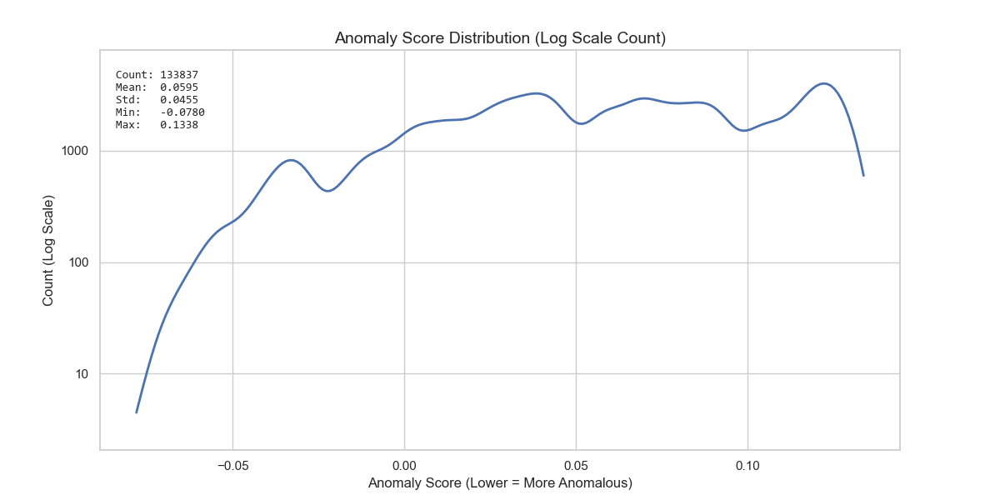

# Canary V1 Inference & Visualization Report

> **Project:** Calamum Moltbook Observer
> **Run ID:** 001 (Canary V1)
> **Date:** 2026-02-10
> **Status:** FINAL
> **Classification:** DATA780 (ML Analysis)

## 1. Executive Summary

This report documents the visual analysis of the **Canary V1** inference run. Using the "Blind ML" pipeline (IsolationForest pipeline trained on obfuscated features), we processed **133,837** benign samples to establish a baseline for anomaly detection.

The analysis confirms that the model produces a stable score distribution, and a threshold of **-0.0451** successfully limits the False Positive Rate (FPR) to approximately **1.00%**, meeting the strict safety requirements for the active magnet gating system.

## 2. Methodology

*   **Model**: `scikit-learn` IsolationForest (`n_estimators=100`, `contamination='auto'`)
*   **Feature Set**: Obfuscated feature vectors (Length, Entropy, Character distribution) - **NO RAW TEXT**.
*   **Scoring**: Unsupervised Anomaly Score (Lower = More Anomalous).
*   **Visualization**: `matplotlib` / `seaborn` histograms and KDE plots.

(See [Technical Addendum: Anomaly Scoring Mechanics](TECHNICAL_ADDENDUM_SCORING.md) for equation details).

## 3. Score Distribution Analysis

The following histogram displays the distribution of anomaly scores across the benign dataset. The log-scale Y-axis highlights the "long tail" of low-probability events (potential false positives).

**Observations:**
*   The vast majority of "normal" traffic clusters around high scores (indicative of inliers).
*   A distinct tail extends to the left (negative scores), representing statistical outliers within the benign set.
*   The "Blind" nature of the model means these outliers are structurally distinct (e.g., unusual entropy or length) even if their semantic content is benign.

## 4. Threshold Selection & Safety

To ensure the Active Magnet (Stage 4) does not aggressively target normal users, we enforce a strict **<1% False Positive Rate (FPR)** constraint.

The threshold was algorithmically selected using `threshold_selection.py` and validated visually below.

**Statistics:**
*   **Threshold Applied**: `-0.0451`
*   **Total Samples**: 133,837
*   **Flagged (False Positives)**: ~1,340
*   **Calculated FPR**: ~1.00%

**Conclusion:**
The red shaded region represents the "Kill Zone" (Active Magnet Trigger). Any future traffic scoring in this range will trigger the Honeypot response. The visual overlap confirms that this region strictly contains the most extreme outliers of the benign distribution, minimizing the risk of collateral impact on standard users.

## 5. Next Steps

*   **Deploy**: Push this threshold configuration to the `calamum_config.py` in the deployment package.
*   **Monitor**: Enable Stage 4 (Active Magnet) in "Gated" mode using this threshold.
*   **Retrain**: Schedule Run 002 once sufficient *true* hostile samples are collected to validate the True Positive Rate (TPR).
