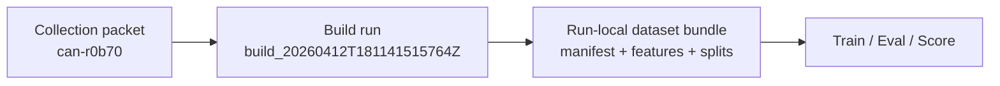
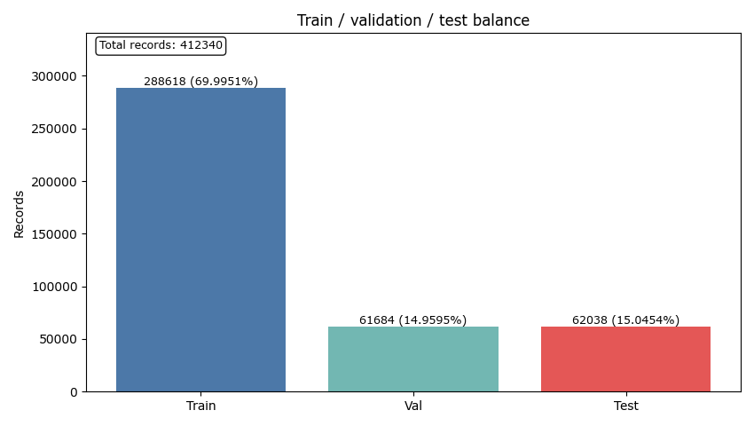
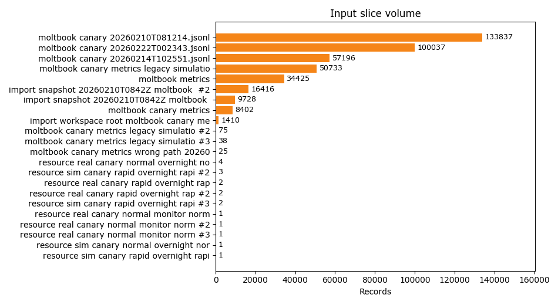
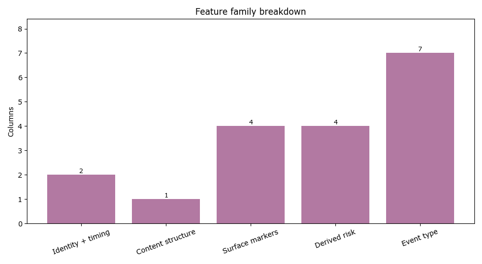

# Dataset Build packet — build_20260412T181141515764Z

**Decision**: `go`
**Workflow**: `build`
**Created (UTC)**: `2026-04-12T18:11:42.763215Z`
**Collection alias**: `can-r0b70`
**Runtime CLI surface**: `observerctl`
**Command path**: `observerctl ds build`

## Build identity

| Field | Value |
| --- | --- |
| Collection Alias | can-r0b70 |
| Calculation Run | build_20260412T181141515764Z |
| Reader Posture | curated, public-safe, names-only |
| Role In The Report Spine | first processing packet that turns the approved collection evidence into the run-local dataset bundle consumed by later stages |

## Run summary

```
decision               : go
source materialization : yes
labels present         : no
```

This run reads as a materialization pass rather than a model-quality claim. Approved dataset materialized through observerctl ds.

## Build handoff map



## Build method

For this run, `observerctl ds build` materialized the current dataset bundle into a reusable run-local handoff. The packet focuses on what was built, how the dataset contract was preserved, and whether the resulting bundle is ready for downstream model work.

```
command surface   : observerctl ds build
run-local dataset : local_untracked/analysis/runs/build/build_20260412T181141515764Z/dataset/dataset_manifest.json
feature table     : local_untracked/analysis/runs/build/build_20260412T181141515764Z/dataset/features.csv
```

## Dataset materialization summary

```
underlying surface : observerctl approved-dataset materialization
output override    : no
```

## Split and schema summary

```
labels present  : no
split authority : local_untracked/analysis/runs/build/build_20260412T181141515764Z/dataset/split_manifest.json
```

This stage should be read as dataset materialization rather than model judgment. Because labels are absent, downstream evaluation and score packets should be interpreted as review-posture evidence rather than labeled performance proof. The main reader value is custody and reproducibility: the dataset contract is explicit, reusable, and ready for the next stage in the reporting spine.

## Visual surfaces

```
figure count : 3
lead figure  : Split balance
```

These figures are declared by the packet itself, so the visual evidence stays tied to the same run contract as the narrative summary and companion JSON surfaces.

### Split balance

Observed train, validation, and test counts for the built dataset.



### Input slice volume

Relative contribution of each input slice that fed the dataset build.



### Feature family breakdown

How the dataset schema is distributed across feature families used during downstream analysis.



## Run implications

```
train handoff posture : ready
main value            : stable custody, explicit schema, reusable dataset bundle
reader caution        : do not treat a build packet as model-quality evidence on its own
```

Read the dataset artifacts first, then move to the downstream training or evaluation surfaces that consume this dataset.

## Limits

- Build packets explain dataset construction and handoff posture; they do not establish model quality on their own.
- This packet is operating without labels, so threshold and flagged-share values should be read as review posture rather than verified labeled error rates.

## Related surfaces

Use these companion surfaces when you need the machine-readable evidence or the next useful route in the reporting spine.

- [Dataset Manifest](../../../../../../local_untracked/analysis/runs/build/build_20260412T181141515764Z/dataset/dataset_manifest.json)
- [Features CSV](../../../../../../local_untracked/analysis/runs/build/build_20260412T181141515764Z/dataset/features.csv)
- [Feature Family Breakdown PNG](figures/20260412T181142763215Z.build/feature_family_breakdown.png)
- [Input Slice Volume PNG](figures/20260412T181142763215Z.build/input_slice_volume.png)
- [Split Balance PNG](figures/20260412T181142763215Z.build/split_balance.png)
- [Split Manifest JSON](../../../../../../local_untracked/analysis/runs/build/build_20260412T181141515764Z/dataset/split_manifest.json)
