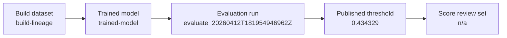

# Evaluation packet — evaluate_20260412T181954946962Z

**Decision**: `go`
**Workflow**: `evaluate`
**Created (UTC)**: `2026-04-12T18:26:21.255204Z`
**Collection alias**: `can-r0b70`
**Runtime CLI surface**: `observerctl`
**Command path**: `observerctl ds evaluate`

## Evaluation identity

| Field | Value |
| --- | --- |
| Collection Alias | can-r0b70 |
| Calculation Run | evaluate_20260412T181954946962Z |
| Reader Posture | curated, public-safe, names-only |
| Role In The Report Spine | threshold-publication packet that explains how the current model and score surface were turned into downstream review posture |

## Run summary

```
decision           : go
threshold          : 0.434329
max FPR constraint : 0.01
score direction    : lower-is-more-anomalous
score column       : score_anomaly
labels present     : no
local figures      : 3
```

This run publishes threshold posture and review-volume evidence instead of claiming labeled certainty. Evaluation completed through observerctl ds.

## Evaluation handoff map



## Evaluation method

For this run, `observerctl ds evaluate` translated the current model response surface into threshold posture, guardrail context, and review-volume evidence. The packet stays focused on how the operating point was selected and what that choice means for the paired score surface.

```
command surface   : observerctl ds evaluate
evaluation ledger : local_untracked/analysis/runs/evaluate/evaluate_20260412T181954946962Z/evaluation/run.json
score surface     : local_untracked/analysis/runs/evaluate/evaluate_20260412T181954946962Z/scoring/scores.csv
```

## Threshold publication summary

```
published threshold : 0.434329
constraint type     : max_fpr
constraint value    : 0.01
score direction     : lower-is-more-anomalous
score column        : score_anomaly
local figures       : 3
```

## Review-set summary

```
labels present : no
```

This stage defines the operating threshold and review burden for the paired score surface. The current operating point is recorded at `0.434329`. Because labels are absent, threshold constraints in this packet should be read as operational guardrails rather than as verified labeled error rates. Declared figures anchor the threshold story in visible evidence instead of leaving the operating point buried in tables alone.

## Visual surfaces

```
figure count    : 3
lead figure     : Metric comparison
score direction : lower-is-more-anomalous
score column    : score_anomaly
```

These figures are declared by the packet itself, so the visual evidence stays tied to the same run contract as the narrative summary and companion JSON surfaces.

### Metric comparison

Evaluation metric comparison bars derived from the report-pack metrics payload.


### Threshold summary

Threshold and FPR summary derived from the evaluation or threshold payload.


### Threshold selection

Lower-tail threshold overlay. Scores at or below the threshold are treated as anomalous.


## Run implications

```
score handoff posture : ready
main value            : explicit operating threshold tied to a concrete review volume
reader caution        : do not read the max-FPR setting as labeled certainty when labels are absent
```

Read the threshold companions and then move to the score-stage surfaces that show the resulting review posture.

## Limits

- Evaluation packets explain threshold and assessment posture; they should be read with care when labels are absent or partial.
- This packet is operating without labels, so threshold and flagged-share values should be read as review posture rather than verified labeled error rates.

## Related surfaces

Use these companion surfaces when you need the machine-readable evidence or the next useful route in the reporting spine.

- [Scores CSV](../../../../../../local_untracked/analysis/runs/evaluate/evaluate_20260412T181954946962Z/scoring/scores.csv)
- [Threshold Report JSON](../../../../../../local_untracked/analysis/runs/evaluate/evaluate_20260412T181954946962Z/scoring/threshold_report.json)
- [Threshold Report MD](../../../../../../local_untracked/analysis/runs/evaluate/evaluate_20260412T181954946962Z/scoring/threshold_report.md)
- [Metric Comparison PNG](figures/20260412T182621255204Z.eval/metric_comparison.png)
- [Run JSON](../../../../../../local_untracked/analysis/runs/evaluate/evaluate_20260412T181954946962Z/evaluation/run.json)
- [Run MD](../../../../../../local_untracked/analysis/runs/evaluate/evaluate_20260412T181954946962Z/evaluation/run.md)
