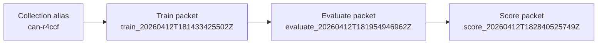

# Collection Packet: can-r4ccf

This collection packet is the entry surface for the current alias before later processing packets are interpreted.

## Collection identity

| Field | Value |
| --- | --- |
| Collection alias | `can-r4ccf` |
| Source scope | `runtime-unspecified` |
| Collection window | `2026-04-12T18:16:02.715320Z -> 2026-04-12T18:31:43.055972Z` |
| Reader posture | `curated, public-safe, names-only` |
| Role in the report spine | entry packet for this specific collection alias before later processing is interpreted |

## Run summary

```
published packets         : 3
workflow families visible : evaluate, score, train
latest packet date        : 2026-04-12T18:31:43.055972Z
latest stage focus        : Score-stage packet with figure-backed anomaly-surface context.
figure-bearing packets    : 2
threshold-bearing packets : 1
baseline link present     : no
```

This collection currently gathers 3 workflow families under one alias, with the newest packet in `score`. Threshold-bearing interpretation is present for this alias and should be followed through the dated evaluation packet and any paired score packet. Run IDs remain lineage context for `can-r4ccf`; the collection alias is the reader-facing packet identity.

## Collection handoff map



## Collection method

This packet is assembled from the currently published stage leaves for the alias, the aggregate routing surfaces, and the canonical source-run pointers carried by the tracked publication spine.

```
collection packet   : docs/reports/collections/can-r4ccf/collection/20260412T183143055972Z.collection.md
latest stage packet : docs/reports/collections/can-r4ccf/processing/score/20260412T183143055972Z.score.md
aggregate report    : docs/reports/aggregates/AGGREGATE_REPORT.md
latest collections  : docs/reports/aggregates/LATEST_COLLECTIONS.md
workflow rollup     : docs/reports/aggregates/WORKFLOW_ROLLUP.md
threshold summary   : docs/reports/aggregates/THRESHOLD_SUMMARY.md
source run root     : local_untracked/analysis/runs/score/score_20260412T182840525749Z
```

## Retention summary

```
published packets retained : 3
first published packet     : 2026-04-12T18:16:02.715320Z
latest published packet    : 2026-04-12T18:31:43.055972Z
stage families visible     : evaluate, score, train
packet replay posture      : ready
```

## Baseline readiness summary

```
baseline window id        : not surfaced
baseline packet ref       : not surfaced
threshold-bearing packets : 1
figure-bearing packets    : 2
publication posture       : ready
```

## Watchdog telemetry summary

```
source scope    : runtime-unspecified
latest workflow : score
latest run id   : score_20260412T182840525749Z
current focus   : Score-stage packet with figure-backed anomaly-surface context.
```

## Librarian accountability summary

```
collection alias        : can-r4ccf
aggregate visibility    : readable
collection packet route : present
stage packet count      : 3
```

## Security linkage summary

```
source run root            : present
source manifest path       : present
machine authority          : outside docs/reports
collection alias stability : alias-first
```

Security linkage is intact when the collection packet, dated stage leaves, and source-run pointers all agree on the same alias-first route.

## Run implications

```
packet to open first     : Score-stage packet with figure-backed anomaly-surface context.
threshold follow-through : available
figure-backed evidence   : available
reader caution           : run IDs remain lineage context; the collection alias is the public packet identity
```

Run IDs remain lineage context for `can-r4ccf`; the collection alias is the reader-facing packet identity.

## Limits

- This collection packet is interpretive; canonical machine-readable authority remains outside `docs/reports/`.
- Absence of a workflow family here means it is not currently in the tracked publication lane; it does not imply the underlying machine artifacts do not exist.
- A collection alias may accumulate multiple dated stage leaves over time, so this packet should be read as the entry surface rather than as the only historical record.

## Processing run ledger

| Published (UTC) | Workflow | Run ID | Collection packet | Stage doc |
| --- | --- | --- | --- | --- |
| 2026-04-12T18:31:43.055972Z | score | `score_20260412T182840525749Z` | [20260412T183143055972Z.collection.md](20260412T183143055972Z.collection.md) | [20260412T183143055972Z.score.md](../processing/score/20260412T183143055972Z.score.md) |
| 2026-04-12T18:26:21.255204Z | evaluate | `evaluate_20260412T181954946962Z` | [20260412T183143055972Z.collection.md](20260412T183143055972Z.collection.md) | [20260412T182621255204Z.eval.md](../processing/eval/20260412T182621255204Z.eval.md) |
| 2026-04-12T18:16:02.715320Z | train | `train_20260412T181433425502Z` | [20260412T183143055972Z.collection.md](20260412T183143055972Z.collection.md) | [20260412T181602715320Z.train.md](../processing/train/20260412T181602715320Z.train.md) |
