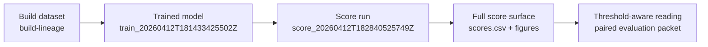

# Scoring packet — score_20260412T182840525749Z

**Decision**: `go`
**Workflow**: `score`
**Created (UTC)**: `2026-04-12T18:31:43.055972Z`
**Collection alias**: `can-r4ccf`
**Runtime CLI surface**: `observerctl`
**Command path**: `observerctl ds score`

## Score identity

| Field | Value |
| --- | --- |
| Collection Alias | can-r4ccf |
| Calculation Run | score_20260412T182840525749Z |
| Model Lineage | train_20260412T181433425502Z |
| Reader Posture | curated, public-safe, names-only |
| Role In The Report Spine | score-surface packet that shows the full anomaly distribution the paired evaluation threshold is selecting from |

## Run summary

```
decision        : go
records scored  : 412,340
score column    : score_anomaly
score direction : lower-is-more-anomalous
local figures   : 1
```

This run publishes the full score surface for the current lineage rather than a standalone flagged-case verdict. Unsupervised scoring completed through observerctl ds.

## Score handoff map



## Score method

For this run, `observerctl ds score` scored the available records into `score_anomaly` and routed any declared figures through the shared visual registry. The packet is meant to explain how the score surface should be read, not to turn the scored set into an unsupported semantic verdict.

```
command surface : observerctl ds score
model reference : local_untracked/analysis/runs/train/train_20260412T181433425502Z/model/model.pkl
score surface   : local_untracked/analysis/runs/score/score_20260412T182840525749Z/scoring/scores.csv
```

## Score surface summary

```
records scored    : 412,340
output override   : no
score column      : score_anomaly
anomaly direction : lower-is-more-anomalous
reason codes      : none
```

## Distribution summary

```
score direction : lower-is-more-anomalous
figure count    : 1
reader message  : Read the scoring companions and threshold context next so the selected review set can be interpreted in context.
```

This stage exposes the score surface rather than making a semantic case judgment about the ranked records. The packet covers `412,340` scored records, which makes the ordering legible across the full scored set rather than only through a narrow flagged slice. The anomaly direction remains `lower-is-more-anomalous`, so the reader should interpret the review-relevant edge accordingly. Declared visual evidence is present, which helps the reader connect the distribution shape to any paired threshold context without confusing score output with final review disposition.

## Visual surfaces

```
figure count    : 1
lead figure     : Score distribution
score direction : lower-is-more-anomalous
score column    : score_anomaly
```

These figures are declared by the packet itself, so the visual evidence stays tied to the same run contract as the narrative summary and companion JSON surfaces.

### Score distribution

Distribution of anomaly scores. Lower scores indicate more anomalous records.


## Run implications

```
review handoff posture : ready
main value             : full score surface that makes the paired threshold interpretable
reader caution         : scoring emits the distribution; threshold selection and final review posture live elsewhere
```

Read the scoring companions and threshold context next so the selected review set can be interpreted in context.

## Limits

- Score packets rank or separate records for review; they do not assign semantic intent to the flagged set.

## Related surfaces

Use these companion surfaces when you need the machine-readable evidence or the next useful route in the reporting spine.

- [Scores CSV](../../../../../../local_untracked/analysis/runs/score/score_20260412T182840525749Z/scoring/scores.csv)
- [Resolved Model Path](../../../../../../local_untracked/analysis/runs/train/train_20260412T181433425502Z/model/model.pkl)
- [Score Distribution PNG](figures/20260412T183143055972Z.score/score_distribution.png)
