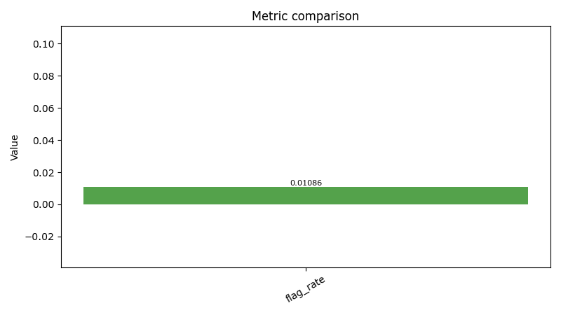
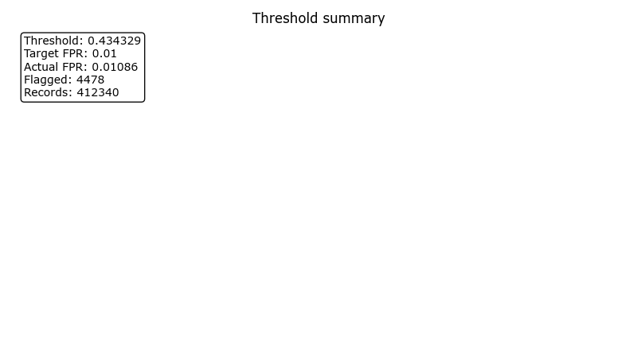
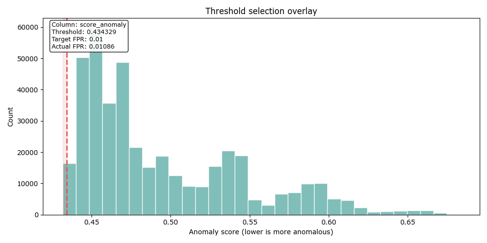

# Evaluation packet — evaluate_20260405T043000438719Z

**Decision**: `go`
**Workflow**: `evaluate`
**Created (UTC)**: `2026-04-05T04:37:59.419248Z`
**Runtime CLI surface**: `observerctl`
**Command path**: `observerctl ds evaluate`

## Executive summary

Evaluation completed through observerctl ds.

## Why this packet exists

This packet explains how the current model output was translated into evaluation evidence and threshold posture.

## Run snapshot

| Field | Value |
| --- | --- |
| Run ID | evaluate_20260405T043000438719Z |
| Workflow | evaluate |
| Packet Role | processing-stage packet |
| Decision | go |
| Created UTC | 2026-04-05T04:37:59.419248Z |
| Runtime CLI Surface | observerctl |
| Command Path | observerctl ds evaluate |

## Context

| Field | Value |
| --- | --- |
| Max FPR | 0.01 |
| Output Override | False |

## What this packet shows

This processing-stage packet currently reports a `go` decision and should be read as a usable handoff within the DS reporting spine. Count-level evidence is present, including `flagged` = `4,478`. Primary metric evidence is available for Flag Rate=0.01086. Threshold posture is recorded for this packet using `lower-is-more-anomalous`. The packet also carries 3 declared figures so the visual evidence stays tied to the same run contract. No blocking reason codes were recorded for this packet.

## Result overview

| Field | Value |
| --- | --- |
| Anomaly Direction | lower-is-more-anomalous |
| Has Labels | False |
| Score Column | score_anomaly |
| Threshold | 0.43432912323643974 |

### Counts

| Flagged | Total |
| ---: | ---: |
| 4478 | 412340 |

### Metrics

| Metric | Value |
| --- | --- |
| Flag Rate | 0.010859969927729543 |

### Reason codes

- none

## Visuals

These figures are declared by the packet itself, so the visual evidence stays tied to the same run contract as the numeric tables and companion JSON.

### Visual summary

| Field | Value |
| --- | --- |
| Anomaly Direction | lower-is-more-anomalous |
| Figure Count | 3 |

### Metric comparison

Evaluation metric comparison bars derived from the report-pack metrics payload.

### Threshold summary

Threshold and FPR summary derived from the evaluation or threshold payload.

### Threshold selection

Lower-tail threshold overlay. Scores at or below the threshold are treated as anomalous.

## Limits and cautions

- Evaluation packets explain threshold and assessment posture; they should be read with care when labels are absent or partial.
- This packet is operating without labels, so threshold and flagged-share values should be read as review posture rather than verified labeled error rates.

## Provenance

This Markdown packet is interpretive. Canonical machine-readable authority remains in `report.json`, `manifest.json`, and the underlying run artifacts referenced below.

### Source lineage

| Field | Value |
| --- | --- |
| Dataset Manifest | `local_untracked/analysis/runs/build/build_20260405T042200983848Z/dataset/dataset_manifest.json` |
| Features CSV | `local_untracked/analysis/runs/build/build_20260405T042200983848Z/dataset/features.csv` |
| Model Path | `local_untracked/analysis/runs/train/train_20260405T042311073706Z/model/model.pkl` |
| Source Run Root | `local_untracked/analysis/runs/evaluate/evaluate_20260405T043000438719Z` |

### Source Report Paths

| Surface | Path |
| --- | --- |
| JSON | `local_untracked/analysis/runs/evaluate/evaluate_20260405T043000438719Z/report/report.json` |
| Manifest | `local_untracked/analysis/runs/evaluate/evaluate_20260405T043000438719Z/report/manifest.json` |
| Markdown | `local_untracked/analysis/runs/evaluate/evaluate_20260405T043000438719Z/report/report.md` |

## Artifact index

These are the primary run-local artifacts referenced by the packet narrative.

| Artifact | Path |
| --- | --- |
| Metric Comparison PNG | `docs/reports/collections/can-r7af3/processing/eval/figures/20260405T043759419248Z.eval/metric_comparison.png` |
| Run JSON | `local_untracked/analysis/runs/evaluate/evaluate_20260405T043000438719Z/evaluation/run.json` |
| Run MD | `local_untracked/analysis/runs/evaluate/evaluate_20260405T043000438719Z/evaluation/run.md` |
| Scores CSV | `local_untracked/analysis/runs/evaluate/evaluate_20260405T043000438719Z/scoring/scores.csv` |
| Threshold Report JSON | `local_untracked/analysis/runs/evaluate/evaluate_20260405T043000438719Z/scoring/threshold_report.json` |
| Threshold Report MD | `local_untracked/analysis/runs/evaluate/evaluate_20260405T043000438719Z/scoring/threshold_report.md` |
| Threshold Selection PNG | `docs/reports/collections/can-r7af3/processing/eval/figures/20260405T043759419248Z.eval/threshold_selection.png` |
| Threshold Summary PNG | `docs/reports/collections/can-r7af3/processing/eval/figures/20260405T043759419248Z.eval/threshold_summary.png` |

## Report paths

These companion surfaces carry the serialized Markdown and JSON outputs for the same run.

| Surface | Path |
| --- | --- |
| Collection Packet MD | `docs/reports/collections/can-r7af3/collection/20260405T043759419248Z.collection.md` |
| Processing Report MD | `docs/reports/collections/can-r7af3/processing/eval/20260405T043759419248Z.eval.md` |

## Reader next steps

Read the threshold companions and then move to the score-stage surfaces that show the resulting review posture.

- [Scores CSV](../../../../../../local_untracked/analysis/runs/evaluate/evaluate_20260405T043000438719Z/scoring/scores.csv)
- [Threshold Report JSON](../../../../../../local_untracked/analysis/runs/evaluate/evaluate_20260405T043000438719Z/scoring/threshold_report.json)
- [Threshold Report MD](../../../../../../local_untracked/analysis/runs/evaluate/evaluate_20260405T043000438719Z/scoring/threshold_report.md)
- [Metric Comparison PNG](figures/20260405T043759419248Z.eval/metric_comparison.png)
- [Run JSON](../../../../../../local_untracked/analysis/runs/evaluate/evaluate_20260405T043000438719Z/evaluation/run.json)
- [Run MD](../../../../../../local_untracked/analysis/runs/evaluate/evaluate_20260405T043000438719Z/evaluation/run.md)
