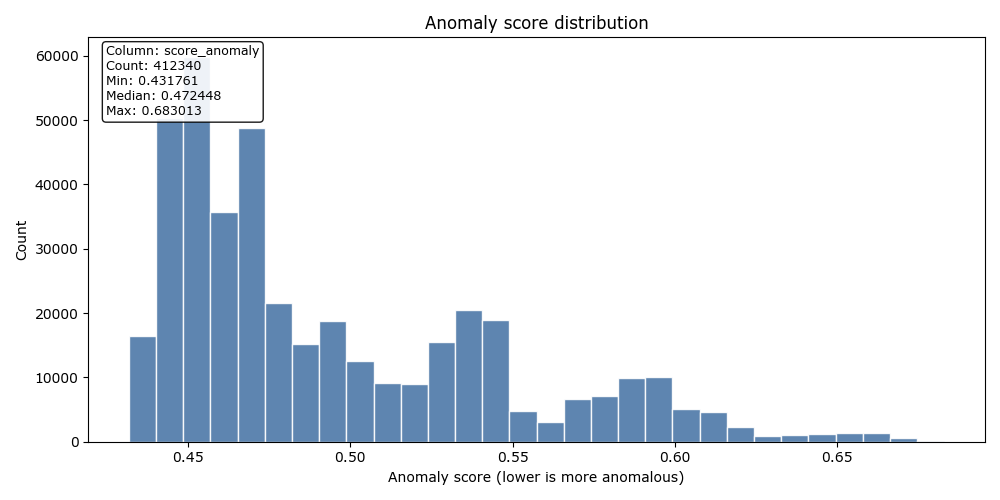

# Scoring packet — score_20260405T044156917446Z

**Decision**: `go`
**Workflow**: `score`
**Created (UTC)**: `2026-04-05T04:46:05.627549Z`
**Runtime CLI surface**: `observerctl`
**Command path**: `observerctl ds score`

## Executive summary

Unsupervised scoring completed through observerctl ds.

## Why this packet exists

This packet explains how the current score surface was turned into a review-ready ordering of records.

## Run snapshot

| Field | Value |
| --- | --- |
| Run ID | score_20260405T044156917446Z |
| Workflow | score |
| Packet Role | processing-stage packet |
| Decision | go |
| Created UTC | 2026-04-05T04:46:05.627549Z |
| Runtime CLI Surface | observerctl |
| Command Path | observerctl ds score |

## Context

| Field | Value |
| --- | --- |
| Output Override | False |

## What this packet shows

This processing-stage packet currently reports a `go` decision and should be read as a usable handoff within the DS reporting spine. Threshold posture is recorded for this packet using `lower-is-more-anomalous`. The packet also carries 1 declared figure so the visual evidence stays tied to the same run contract. No blocking reason codes were recorded for this packet.

## Result overview

| Field | Value |
| --- | --- |
| Anomaly Direction | lower-is-more-anomalous |
| Records Scored | 412340 |
| Score Column | score_anomaly |

### Reason codes

- none

## Visuals

These figures are declared by the packet itself, so the visual evidence stays tied to the same run contract as the numeric tables and companion JSON.

### Visual summary

| Field | Value |
| --- | --- |
| Anomaly Direction | lower-is-more-anomalous |
| Figure Count | 1 |

### Score distribution

Distribution of anomaly scores. Lower scores indicate more anomalous records.

## Limits and cautions

- Score packets rank or separate records for review; they do not assign semantic intent to the flagged set.

## Provenance

This Markdown packet is interpretive. Canonical machine-readable authority remains in `report.json`, `manifest.json`, and the underlying run artifacts referenced below.

### Source lineage

| Field | Value |
| --- | --- |
| Dataset Manifest | `local_untracked/analysis/runs/build/build_20260405T042200983848Z/dataset/dataset_manifest.json` |
| Model Reference | `local_untracked/analysis/runs/train/train_20260405T042311073706Z/model/train_manifest.json` |
| Source Run Root | `local_untracked/analysis/runs/score/score_20260405T044156917446Z` |

### Source Report Paths

| Surface | Path |
| --- | --- |
| JSON | `local_untracked/analysis/runs/score/score_20260405T044156917446Z/report/report.json` |
| Manifest | `local_untracked/analysis/runs/score/score_20260405T044156917446Z/report/manifest.json` |
| Markdown | `local_untracked/analysis/runs/score/score_20260405T044156917446Z/report/report.md` |

## Artifact index

These are the primary run-local artifacts referenced by the packet narrative.

| Artifact | Path |
| --- | --- |
| Resolved Model Path | `local_untracked/analysis/runs/train/train_20260405T042311073706Z/model/model.pkl` |
| Score Distribution PNG | `docs/reports/collections/can-r7af3/processing/score/figures/20260405T044605627549Z.score/score_distribution.png` |
| Scores CSV | `local_untracked/analysis/runs/score/score_20260405T044156917446Z/scoring/scores.csv` |

## Report paths

These companion surfaces carry the serialized Markdown and JSON outputs for the same run.

| Surface | Path |
| --- | --- |
| Collection Packet MD | `docs/reports/collections/can-r7af3/collection/20260405T044605627549Z.collection.md` |
| Processing Report MD | `docs/reports/collections/can-r7af3/processing/score/20260405T044605627549Z.score.md` |

## Reader next steps

Read the scoring companions and threshold context next so the selected review set can be interpreted in context.

- [Scores CSV](../../../../../../local_untracked/analysis/runs/score/score_20260405T044156917446Z/scoring/scores.csv)
- [Resolved Model Path](../../../../../../local_untracked/analysis/runs/train/train_20260405T042311073706Z/model/model.pkl)
- [Score Distribution PNG](figures/20260405T044605627549Z.score/score_distribution.png)
