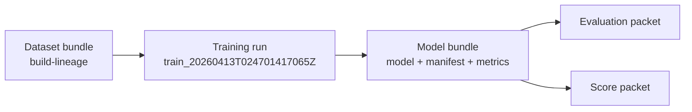

# Model Training packet — train_20260413T024701417065Z

**Decision**: `go`
**Workflow**: `train`
**Created (UTC)**: `2026-04-13T02:47:01.872614Z`
**Collection alias**: `liv-rd3bb`
**Runtime CLI surface**: `observerctl`
**Command path**: `observerctl ds train`

## Training identity

| Field | Value |
| --- | --- |
| Collection Alias | liv-rd3bb |
| Calculation Run | train_20260413T024701417065Z |
| Reader Posture | curated, public-safe, names-only |
| Role In The Report Spine | model-publication packet that turns the current dataset bundle into the trained artifact consumed by downstream evaluation and scoring |

## Run summary

```
decision        : go
model type      : supervised
seed            : 42
metrics emitted : 4
local figures   : 0
```

This run reads as artifact publication rather than as a metric-heavy training story. Model training completed through observerctl ds.

## Training handoff map



## Training method

For this run, `observerctl ds train` consumed the current dataset bundle and wrote the trained-model handoff surfaces that downstream evaluation and scoring will read. The packet emphasizes lineage continuity and fit-posture truth rather than pretending that artifact publication alone proves deployment readiness.

```
command surface : observerctl ds train
model bundle    : local_untracked/analysis/runs/train/train_20260413T024701417065Z/model/model.pkl
train manifest  : local_untracked/analysis/runs/train/train_20260413T024701417065Z/model/train_manifest.json
```

## Model publication summary

```
published model type : supervised
output override      : no
metrics payload      : 4
local figures        : 0
```

## Feature contract summary

```
metrics emitted : 4
figure count    : 0
```

This stage should be read as a model-publication handoff rather than as the final word on model quality. The reported model type is `supervised`, which matters mainly as context for how the downstream evaluation and score surfaces should be interpreted. Metric evidence is available, but the packet should still be paired with downstream evaluation before it is treated as a readiness signal.

## Visual surfaces

```
figure count : 0
lead figure  : none emitted
```

No declared figures were emitted for this packet. Treat that as an honest reporting gap: the current training lane publishes artifact custody more strongly than plot-level model posture, so downstream evaluation should carry more of the explanatory burden.

## Run implications

```
eval handoff posture  : ready
score handoff posture : ready
main value            : reusable model custody with explicit lineage
reader caution        : training posture still needs downstream evaluation before it becomes a readiness signal
```

Read the model and evaluation companions next so the fitting posture can be interpreted through downstream performance evidence. The next useful read is whichever evaluation or scoring surface turns the published model artifact into observable downstream behavior.

## Limits

- Training packets explain fit posture and produced model artifacts; they do not by themselves establish deployment readiness.

## Related surfaces

Use these companion surfaces when you need the machine-readable evidence or the next useful route in the reporting spine.

- [Model Path](../../../../../../local_untracked/analysis/runs/train/train_20260413T024701417065Z/model/model.pkl)
- [Metrics Path](../../../../../../local_untracked/analysis/runs/train/train_20260413T024701417065Z/model/metrics.json)
- [Train Manifest](../../../../../../local_untracked/analysis/runs/train/train_20260413T024701417065Z/model/train_manifest.json)
