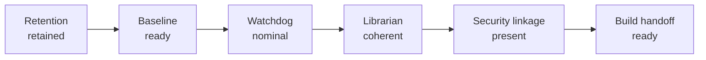

## Collection identity

| Field | Value |
| --- | --- |
| Collection alias | `sample` |
| Source scope | `real:canary` |
| Collection window | `2026-04-04 09:00 UTC -> 2026-04-04 11:00 UTC` |
| Reader posture | curated, public-safe, names-only |
| Role in the report spine | entry packet for this specific collection run before later processing is interpreted |

## Run summary

```
resource index entries in window : 12
evidence packets linked          : 5
baseline analysis decision       : go
filesystem baseline              : intact
watchdog posture                 : canary
watchdog freshness               : current
librarian accountability         : coherent
security linkage                 : present
```

This run reads as fully retained, ready, coherent, and linked.

## Collection handoff map



## Collection method

This packet was assembled from retained `real:canary` telemetry, baseline analysis, watchdog state, librarian accountability surfaces, and gate/evidence linkage fields.

```
command example : [placeholder: collection run route](#placeholder-command-example-collection-run-route)
definitions     : [placeholder: collection method terms](#placeholder-definition-collection-method-terms)
```

```
retained telemetry source : logs/data/calamum/observer_derived/real/canary/
retention authorities      : resource/index.jsonl
                             archived resource_real_canary_* segments
                             evidence/index.jsonl
readiness authorities      : observerctl baseline analyze --source real --mode canary --json
                             observerctl baseline status --json
                             observerctl baseline check --json
posture authorities        : logs/control/calamum/watchdog_posture_state.json
                             logs/control/calamum/watchdog_resource_state.json
                             observerctl watchdog check --json
accountability authorities : observerctl librarian stats --json
                             observerctl librarian stores --json
                             observerctl health full --json
linkage authorities        : run_id
                             posture_trigger_id
                             posture_trigger
                             security_report_ref
                             observerctl ops keysmith
```

## Retention summary

```
collection window retained : yes
archived resource segments : 12
evidence index state       : linked
replay posture             : ready
```

Retention is complete for the sample window. Nothing in the retained surface set makes this run read as unusually sparse or unusually noisy.

## Baseline readiness summary

Baseline analysis for this run comes from `observerctl baseline analyze --source real --mode canary --json`.

```
command example : [placeholder: baseline analyze](#placeholder-command-example-baseline-analyze)
definitions     : [placeholder: baseline readiness](#placeholder-definition-baseline-readiness)
```

```
baseline decision         : go
baseline_ready            : true
normal sample sufficiency : met
baseline window sufficiency : met
filesystem baseline state : intact
```

Baseline posture is clean for this run. The readiness surfaces read as ordinary rather than borderline.

## Watchdog telemetry summary

Watchdog status for this run comes from `logs/control/calamum/watchdog_posture_state.json`, `logs/control/calamum/watchdog_resource_state.json`, and `observerctl watchdog check --json`.

```
command example : [placeholder: watchdog check](#placeholder-command-example-watchdog-check)
definitions     : [placeholder: watchdog posture](#placeholder-definition-watchdog-posture)
```

```
posture state         : canary
heartbeat freshness   : current
CPU band              : nominal
RAM band              : nominal
spike score band      : nominal
watchdog check status : pass
```

Watchdog telemetry is uneventful for this run. No single metric in this summary demands special handling downstream.

## Librarian accountability summary

```
librarian stats surface : readable
librarian stores surface : readable
retained lane accounting : coherent
archive accounting      : coherent
collection alias        : sample
```

Accountability surfaces agree on what was kept and where it belongs. This run does not carry a custody or discoverability anomaly.

## Security linkage summary

Gate/evidence linkage for this run is carried by `run_id`, `posture_trigger_id`, `posture_trigger`, and `security_report_ref`.

```
command example : [placeholder: security linkage surfaces](#placeholder-command-example-security-linkage)
definitions     : [placeholder: security linkage terms](#placeholder-definition-security-linkage-terms)
```

```
run_id            : present
posture_trigger_id : present
posture_trigger   : present
security_report_ref : present
KEYSMITH surface  : readable
```

Security linkage is intact. The collection is attached to a named receipt chain rather than floating as an orphaned packet.

## Run implications

```
build handoff posture : ordinary, fully linked
exception state       : none recorded in retained surfaces
downstream note       : later stages should only call out actual deviation
```


## Limits

- This is a sample collection document, not a production readiness claim.
- The collection report is interpretive; canonical machine-readable authority remains in the retained JSON packets, indexes, manifests, and control-state files.
- A single collection can feed more than one processing run, so this document should summarize the retained evidence once and then track downstream processing separately.

## Processing run ledger

### [2026-04-04](../processing/build/20260404.build.md)

```
time              : 09:00 UTC
source:mode       : real:canary
collection window : 2026-04-04 09:00 UTC -> 2026-04-04 11:00 UTC
relevant note     : first processing run for this sample collection
                    baseline-analysis, watchdog, librarian,
                    and security-linkage surfaces were present for handoff
```
