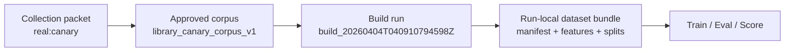

## Build identity

| Field | Value |
| --- | --- |
| Collection alias | `sample` |
| Source scope | `real:canary` |
| Calculation run | `build_20260404T040910794598Z` |
| Lineage dataset | `library_canary_corpus_v1` |
| Reader posture | curated, public-safe, names-only |
| Role in the report spine | first processing packet that turns the approved canary corpus into the run-local dataset bundle consumed by later stages |

## Run summary

```
decision               : go
source materialization : true
total records          : 412,340
labels present         : no
seed                   : 42
split plan             : 70 / 15 / 15
train / val / test     : 288,618 / 61,684 / 62,038
feature columns        : 18
```

This run reads as a materialization pass, not a rescue pass. The published packet points to an already approved canary corpus and rebinds it into the local build bundle that later stages consume.

## Build handoff map



## Build method

This packet is grounded in the run-local build bundle plus its approved lineage manifest. For this run, `observerctl ds build` did not introduce labels or alternate output routing; it materialized the approved canary corpus into a run-scoped dataset manifest, feature table, and split ledger.

```
command example : [placeholder: build run route](#placeholder-command-example-build-run-route)
definitions     : [placeholder: build-stage terms](#placeholder-definition-build-stage-terms)
```

```
upstream packet   : [collection](../../collection/20260404.collection.md)
runtime report    : local_untracked/analysis/runs/build/build_20260404T040910794598Z/report/report.json
                    local_untracked/analysis/runs/build/build_20260404T040910794598Z/report/manifest.json
                    local_untracked/analysis/runs/build/build_20260404T040910794598Z/report/report.md
run-local dataset : local_untracked/analysis/runs/build/build_20260404T040910794598Z/dataset/dataset_manifest.json
                    local_untracked/analysis/runs/build/build_20260404T040910794598Z/dataset/features.csv
                    local_untracked/analysis/runs/build/build_20260404T040910794598Z/dataset/split_manifest.json
                    local_untracked/analysis/runs/build/build_20260404T040910794598Z/dataset/splits.csv
lineage authority : local_untracked/analysis/datasets/library_canary_corpus_v1/dataset_manifest.json
downstream packet : [train](../train/20260404.train.md)
reference surface : [generated report surfaces](../../../../reference/GENERATED_REPORT_SURFACES.md)
```

## Dataset materialization summary

```
underlying surface     : observerctl approved-dataset materialization
output override        : false
lineage created        : 2026-04-02T01:14:22.384464Z
input files tracked    : 22
schema version         : obfuscated_record_v1
lineage and run totals : aligned
```

This stage is mainly about custody and reuse. The run-local manifest and the lineage manifest agree on record count, schema family, and split plan, so the downstream stages are standing on a copied approved corpus rather than a one-off rebuild.

## Split and schema summary

```
train rows      : 288,618
val rows        : 61,684
test rows       : 62,038
split authority : split_manifest.json
labels csv      : none
```

```
identity/time : record_id, ts_epoch
structural    : content_length, has_code_block, has_link
engagement    : tags_count, mentions_count
heuristic     : f_complexity, f_code_density, f_toxicity
route flags   : is_canary, type_post, type_reply, type_repost,
                type_dm, type_follow, type_mention, type_unknown
```

The feature set is compact and legible. A reader can still tell what each column family is doing without paging through a giant transform log.

## Feature-table profile

```
canary-flagged rows : 412,322
link rows           : 44,422
code-block rows     : 28,578
content length      : avg 21.0, max 57
mentions            : avg 0.07, max 1
tags                : avg 0.34, max 2
toxicity buckets    : 0 -> 412,340
complexity values   : all 0.000 in this materialization
code density values : all 0.000 in this materialization
```

The dominant signal here is flatness. This corpus carries broad route coverage and some structural variety, while the heuristic columns remain effectively dormant in this materialization; later documents should treat those fields as structural placeholders rather than major drivers.

## Route mix

```
post    : 47,160
reply   : 47,536
repost  : 47,407
dm      : 66,340
follow  : 66,795
mention : 66,782
unknown : 70,320
```

No single route family dominates the dataset. The build bundle reads like broad operational telemetry rather than a narrowly filtered subtype export.

## Run implications

```
train handoff posture : ready
main value            : stable custody, explicit splits, reusable schema
reader caution        : do not over-interpret complexity, code-density,
                    or toxicity columns for this run; they are zero-filled
                    across the materialized feature table
```

## Limits

- This is a sample stage packet anchored to one published build run: `build_20260404T040910794598Z`.
- The canonical machine-readable authority remains in the build run ledger, run-local manifests, and lineage dataset manifest.
- A later build publication for the same alias can coexist beside this one under the dated stage lane.

Next in lineage: [Training report](../train/20260404.train.md)