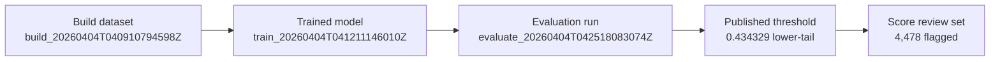

## Evaluation identity

| Field | Value |
| --- | --- |
| Collection alias | `sample` |
| Source scope | `real:canary` |
| Calculation run | `evaluate_20260404T042518083074Z` |
| Build lineage | `build_20260404T040910794598Z` |
| Model lineage | `train_20260404T041211146010Z` |
| Reader posture | curated, public-safe, names-only |
| Role in the report spine | threshold-publication packet that explains how the trained model, the canary score surface, and the built dataset were turned into the downstream review posture |

## Run summary

```
decision             : go
threshold            : 0.434329
max FPR constraint   : 0.01
score direction      : lower is more anomalous
score column         : score_anomaly
records evaluated    : 412,340
flagged records      : 4,478
flag rate            : 1.086%
labels present       : no
local figures        : 3
```

This run publishes a threshold posture for an unlabeled canary corpus using the trained model's anomaly scores directly. It does not offer a labeled false-positive measurement; it establishes the operating point, the realized flagged share on the score surface, and the evaluation bundle that justifies the next score-stage handoff.

## Evaluation handoff map



## Evaluation method

This packet is grounded in the evaluation run bundle, the upstream build dataset, and the trained model artifact. For this run, `observerctl ds evaluate` consumed names-only features with no labels, loaded the trained model, scored the canary feature table into `score_anomaly`, selected a lower-tail operating threshold, and emitted a threshold publication bundle plus three local figures.

```
command example : [placeholder: evaluation run route](#placeholder-command-example-evaluation-run-route)
definitions     : [placeholder: evaluation-stage terms](#placeholder-definition-evaluation-stage-terms)
```

```
upstream packet   : [train](../train/20260404.train.md)
runtime report    : local_untracked/analysis/runs/evaluate/evaluate_20260404T042518083074Z/report/report.json
                    local_untracked/analysis/runs/evaluate/evaluate_20260404T042518083074Z/report/manifest.json
                    local_untracked/analysis/runs/evaluate/evaluate_20260404T042518083074Z/report/report.md
evaluation ledger : local_untracked/analysis/runs/evaluate/evaluate_20260404T042518083074Z/evaluation/run.json
                    local_untracked/analysis/runs/evaluate/evaluate_20260404T042518083074Z/evaluation/run.md
score surface      : local_untracked/analysis/runs/evaluate/evaluate_20260404T042518083074Z/scoring/scores.csv
                    local_untracked/analysis/runs/evaluate/evaluate_20260404T042518083074Z/scoring/threshold_report.json
                    local_untracked/analysis/runs/evaluate/evaluate_20260404T042518083074Z/scoring/threshold_report.md
visual surfaces   : local_untracked/analysis/runs/evaluate/evaluate_20260404T042518083074Z/figures/threshold_summary.png
                    local_untracked/analysis/runs/evaluate/evaluate_20260404T042518083074Z/figures/threshold_selection.png
                    local_untracked/analysis/runs/evaluate/evaluate_20260404T042518083074Z/figures/metric_comparison.png
dataset lineage   : local_untracked/analysis/runs/build/build_20260404T040910794598Z/dataset/dataset_manifest.json
model lineage     : local_untracked/analysis/runs/train/train_20260404T041211146010Z/model/model.pkl
downstream packet : [score](../score/20260404.score.md)
```

## Threshold publication summary

```
published threshold : 0.434329
constraint type     : max_fpr
constraint value    : 1.00%
score direction     : lower-is-more-anomalous
score column        : score_anomaly
realized rate       : 1.086%
output override     : true
privacy review      : pass
reason codes        : none
```

The key nuance is that this run is still unlabeled. The `max_fpr` setting remains the declared guardrail in the evaluation context, not a measured labeled false-positive result on holdout data. What this packet actually publishes is the chosen threshold, the realized selected share on the model's score surface, and the review volume that threshold creates.

## Review-set summary

```
records evaluated : 412,340
flagged records   : 4,478
flagged share     : 1.086%
labels csv        : none
governance note   : names-only evaluation; no semantic payload consumed or emitted
```

This review lane is materially narrower than the earlier placeholder packet because the evaluation now uses the trained model's score distribution rather than a blunt quantile-only threshold. The later score packet should therefore read as a tighter review surface whose selected tail is visible and inspectable, not as an opaque cutoff decision.

## Visual surfaces

```
figure count       : 3
lead figure        : threshold_selection.png
support figure     : threshold_summary.png
weaker figure      : metric_comparison.png
strongest message  : visible lower-tail cutoff + realized selected share + score spread in one view
```

This run now has the visual surface it was missing before. The threshold-selection overlay is the anchor figure because it shows the actual score distribution, marks the lower-tail cutoff, and lets a reader see that the selected review set is a small left-tail slice rather than an arbitrary bar-chart abstraction. The threshold summary card remains useful as a compact companion because it repeats the same operating point, target guardrail, and realized selected share in a one-glance form.

## Run implications

```
score handoff posture : ready
main value            : explicit lower-tail operating point tied to a visible score surface and concrete review volume
reader caution        : do not read the max-FPR constraint as a labeled error result;
                    this packet is unlabeled and score-selection-centric
```

## Limits

- This is a sample stage packet anchored to one published evaluation run: `evaluate_20260404T042518083074Z`.
- The canonical machine-readable authority remains in the evaluation ledger, report bundle, build dataset manifest, and model artifact lineage.
- A later evaluation publication for the same alias can coexist beside this one under the dated stage lane.

Next in lineage: [Score report](../score/20260404.score.md)