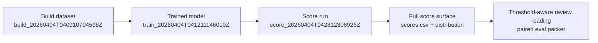

## Score identity

| Field | Value |
| --- | --- |
| Collection alias | `sample` |
| Source scope | `real:canary` |
| Calculation run | `score_20260404T042812306926Z` |
| Build lineage | `build_20260404T040910794598Z` |
| Model lineage | `train_20260404T041211146010Z` |
| Reader posture | curated, public-safe, names-only |
| Role in the report spine | score-surface packet that shows the full anomaly distribution the paired evaluation threshold is selecting from |

## Run summary

```
decision             : go
records scored       : 412,340
score column         : score_anomaly
score direction      : lower is more anomalous
score range          : 0.431761 -> 0.683013
median score         : 0.472448
local figures        : 1
```

This run publishes the full score surface for the sample lineage. It does not itself publish a flagged set or apply a cutoff; instead, it shows the distribution that the paired evaluation packet interprets when it publishes the lower-tail threshold.

## Score handoff map



## Score method

This packet is grounded in the score run bundle, the upstream build dataset manifest, and the trained model reference. For this run, `observerctl ds score` resolved the published unsupervised model, scored the full canary feature table into `score_anomaly`, wrote a complete `scores.csv`, and emitted a single distribution figure that makes the lower-tail review region visible.

```
command example : [placeholder: scoring run route](#placeholder-command-example-scoring-run-route)
definitions     : [placeholder: scoring-stage terms](#placeholder-definition-scoring-stage-terms)
```

```
upstream packet   : [train](../train/20260404.train.md)
threshold context : [eval](../eval/20260404.eval.md)
runtime report    : local_untracked/analysis/runs/score/score_20260404T042812306926Z/report/report.json
                    local_untracked/analysis/runs/score/score_20260404T042812306926Z/report/manifest.json
                    local_untracked/analysis/runs/score/score_20260404T042812306926Z/report/report.md
score surface     : local_untracked/analysis/runs/score/score_20260404T042812306926Z/scoring/scores.csv
visual surfaces   : local_untracked/analysis/runs/score/score_20260404T042812306926Z/figures/score_distribution.png
lineage authority : local_untracked/analysis/runs/build/build_20260404T040910794598Z/dataset/dataset_manifest.json
model reference   : local_untracked/analysis/runs/train/train_20260404T041211146010Z/model/train_manifest.json
reference surface : [generated report surfaces](../../../../reference/GENERATED_REPORT_SURFACES.md)
```

## Score surface summary

```
records scored    : 412,340
output override   : false
score column      : score_anomaly
anomaly direction : lower-is-more-anomalous
reason codes      : none
```

The score run covers the full build lineage count, which matters because it means this packet is showing the complete model response surface rather than a narrow sample. That makes the later threshold interpretation legible at collection scale instead of only at reviewer-slice scale.

## Distribution summary

```
minimum score          : 0.431761
median score           : 0.472448
maximum score          : 0.683013
paired eval threshold  : 0.434329
left-tail interpretation : only a thin slice sits at or below the published eval cutoff
```

The distribution is broad and visibly multi-modal, but the anomaly direction keeps the reading simple: the left edge is the review-relevant edge. Because the paired evaluation threshold sits only slightly above the observed minimum, this packet reads as a mostly intact score surface with a very thin lower-tail slice reserved for the downstream review set.

## Visual surfaces

```
figure count       : 1
lead figure        : score_distribution.png
figure message     : complete score surface with visible lower-tail review region
missing companion  : no threshold overlay inside the score packet itself
```

This plot is the useful one. It shows the actual anomaly-score spread, anchors the minimum/median/maximum values in a single view, and makes the paired evaluation threshold easy to reason about even though the threshold line itself is published in the evaluation packet rather than here.

## Run implications

```
review handoff posture : ready
main value             : full score surface that makes the published threshold interpretable
reader caution         : do not read this packet as a flagged-case report;
                    scoring emits the distribution, while threshold selection lives in eval
```

## Limits

- This is a sample stage packet anchored to one published score run: `score_20260404T042812306926Z`.
- The canonical machine-readable authority remains in the score run ledger, `scores.csv`, and the paired train/build lineage artifacts.
- A later scoring publication for the same alias can coexist beside this one under the dated stage lane.

Next in lineage: [Aggregate report](../../../../aggregates/AGGREGATE_REPORT.md)