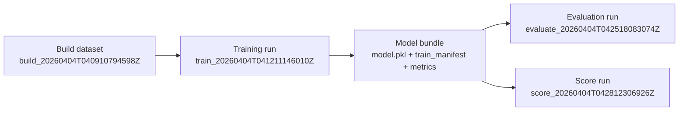

## Training identity

| Field | Value |
| --- | --- |
| Collection alias | `sample` |
| Source scope | `real:canary` |
| Calculation run | `train_20260404T041211146010Z` |
| Build lineage | `build_20260404T040910794598Z` |
| Reader posture | curated, public-safe, names-only |
| Role in the report spine | model-publication packet that turns the run-local build bundle into the trained artifact consumed by evaluation and scoring |

## Run summary

```
decision             : go
model type           : unsupervised
seed                 : 42
lineage records      : 412,340
feature columns      : 18
metrics emitted      : 0
local figures        : 0
```

This run reads as artifact publication rather than as a metric-heavy training story. The packet exists to show that the approved build bundle was converted into a stable reusable model handoff, even though the current unsupervised training surface does not yet emit richer fit diagnostics or plots.

## Training handoff map



## Training method

This packet is grounded in the training run bundle plus the upstream build dataset manifest. For this run, `observerctl ds train` consumed the run-local canary dataset, produced an unsupervised model artifact, wrote a train manifest that preserves the feature contract, and emitted no alternate output routing, figures, or populated training metrics.

```
command example : [placeholder: training run route](#placeholder-command-example-training-run-route)
definitions     : [placeholder: training-stage terms](#placeholder-definition-training-stage-terms)
```

```
upstream packet   : [build](../build/20260404.build.md)
runtime report    : local_untracked/analysis/runs/train/train_20260404T041211146010Z/report/report.json
                    local_untracked/analysis/runs/train/train_20260404T041211146010Z/report/manifest.json
                    local_untracked/analysis/runs/train/train_20260404T041211146010Z/report/report.md
model bundle      : local_untracked/analysis/runs/train/train_20260404T041211146010Z/model/model.pkl
                    local_untracked/analysis/runs/train/train_20260404T041211146010Z/model/train_manifest.json
                    local_untracked/analysis/runs/train/train_20260404T041211146010Z/model/metrics.json
lineage authority : local_untracked/analysis/runs/build/build_20260404T040910794598Z/dataset/dataset_manifest.json
downstream packet : [eval](../eval/20260404.eval.md)
parallel packet   : [score](../score/20260404.score.md)
reference surface : [generated report surfaces](../../../../reference/GENERATED_REPORT_SURFACES.md)
```

## Model publication summary

```
published model type : unsupervised
output override      : false
metrics payload      : empty object
artifact trio        : model.pkl + train_manifest.json + metrics.json
reason codes         : none
```

The important thing here is contract preservation. The train manifest captures the dataset lineage, feature column set, and run parameters, so later stages are not depending on a mystery pickle dropped into a folder without provenance.

## Lineage dataset summary

```
total rows       : 412,340
split plan       : 70 / 15 / 15
train rows       : 288,618
val rows         : 61,684
test rows        : 62,038
labels available : no
```

This packet inherits the same names-only canary materialization that the build stage published. The training surface itself does not add label-aware diagnostics, so the key reader value is that the model sits on top of a broad, explicitly partitioned dataset bundle rather than an ad hoc sample.

## Feature contract summary

```
identity/time : record_id, ts_epoch
structural    : content_length, has_code_block, has_link
engagement    : tags_count, mentions_count
heuristic     : f_complexity, f_code_density, f_toxicity
route flags   : is_canary, type_post, type_reply, type_repost,
                type_dm, type_follow, type_mention, type_unknown
```

The train manifest preserves the same compact 18-column feature family used by the build bundle. That continuity matters more than any single metric here, because it makes the later evaluation and score packets legible as direct descendants of the published dataset contract.

## Visual surfaces

```
figure count       : 0
lead figure        : none emitted
current gap        : no fit diagnostic or feature-importance plot
reader message     : training currently publishes custody artifacts more strongly than visualization
```

This is the clearest remaining gap in the processing spine. The training stage is operationally useful and reproducible, but it still does not give the reader a plot-level view of model behavior; that missing visual surface should be addressed in the later visualization run rather than hand-waved away here.

## Run implications

```
eval handoff posture  : ready
score handoff posture : ready
main value            : reusable model custody with explicit lineage and feature contract
reader caution        : do not over-read training quality from this packet alone;
                    the current train surface publishes artifact provenance more than quantitative fit evidence
```

## Limits

- This is a sample stage packet anchored to one published train run: `train_20260404T041211146010Z`.
- The canonical machine-readable authority remains in the train run ledger, model bundle, and upstream build dataset manifest.
- A later training publication for the same alias can coexist beside this one under the dated stage lane.

Next in lineage: [Evaluation report](../eval/20260404.eval.md)