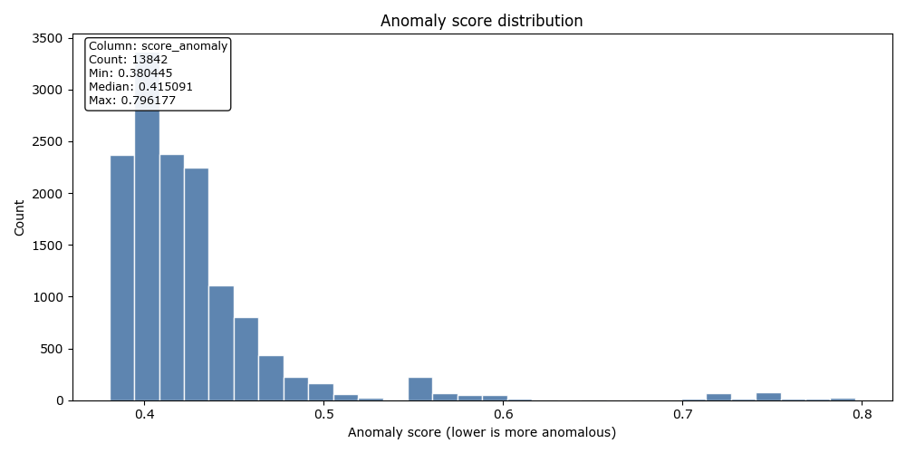

# Scoring packet — score_20260406T170017731886Z

**Decision**: `go`
**Workflow**: `score`
**Created (UTC)**: `2026-04-06T17:00:30.764817Z`
**Runtime CLI surface**: `observerctl`
**Command path**: `observerctl ds score`

## Executive summary

Unsupervised scoring completed through observerctl ds.

## Stage purpose

This packet explains how the current score surface was turned into a review-ready ordering of records.

## Stage identity

| Field | Value |
| --- | --- |
| Run ID | score_20260406T170017731886Z |
| Workflow | score |
| Packet Role | processing-stage packet |
| Decision | go |
| Created UTC | 2026-04-06T17:00:30.764817Z |

## Inputs used

- The score stage is anchored to the full score surface so the packet can explain ordering and review posture across the complete scored set instead of a narrow sample.
- A resolved trained-model reference is retained so the score surface can be read as a direct descendant of the published training handoff.

## Method summary

For this run, `observerctl ds score` scored the available records into `score_anomaly` and routed any declared figures through the shared visual registry. The packet is meant to explain how the score surface should be read, not to turn the scored set into an unsupported semantic verdict.

## Key results

This section highlights the strongest run-level evidence for the current stage without duplicating the full machine-readable payload.

### Stage summary

| Field | Value |
| --- | --- |
| Records Scored | 13842 |
| Score Column | score_anomaly |
| Anomaly Direction | lower-is-more-anomalous |
| Figure Count | 1 |

### Reason codes

- none

## Interpretation

This stage exposes the score surface rather than making a semantic case judgment about the ranked records. The packet covers `13,842` scored records, which makes the ordering legible across the full scored set rather than only through a narrow flagged slice. The anomaly direction remains `lower-is-more-anomalous`, so the reader should interpret the review-relevant edge accordingly. Declared visual evidence is present, which helps the reader connect the distribution shape to any paired threshold context without confusing score output with final review disposition.

## Visual surfaces

These figures are declared by the packet itself, so the visual evidence stays tied to the same run contract as the narrative summary and companion JSON surfaces.

### Visual summary

| Field | Value |
| --- | --- |
| Anomaly Direction | lower-is-more-anomalous |
| Score Column | score_anomaly |
| Figure Count | 1 |

### Score distribution

Distribution of anomaly scores. Lower scores indicate more anomalous records.

## Risks, limits, and non-claims

- Score packets rank or separate records for review; they do not assign semantic intent to the flagged set.

## What follows from this stage

Read the scoring companions and threshold context next so the selected review set can be interpreted in context.

## Related surfaces

Use these companion surfaces when you need the machine-readable evidence or the next useful route in the reporting spine.

- [Scores CSV](../../../../../../local_untracked/analysis/runs/score/score_20260406T170017731886Z/scoring/scores.csv)
- [Resolved Model Path](../../../../../../local_untracked/analysis/runs/train/train_20260406T165940271708Z/model/model.pkl)
- [Score Distribution PNG](figures/20260406T170030764817Z.score/score_distribution.png)

## Provenance

This Markdown packet is interpretive. Canonical machine-readable authority remains in `report.json`, `manifest.json`, and the underlying run artifacts referenced below.

### Source lineage

| Field | Value |
| --- | --- |
| Dataset Manifest | `local_untracked/analysis/datasets/p3_demo_current_collection_20260406/dataset/dataset_manifest.json` |
| Model Reference | `local_untracked/analysis/runs/train/train_20260406T165940271708Z/model/train_manifest.json` |
| Source Run Root | `local_untracked/analysis/runs/score/score_20260406T170017731886Z` |

### Source Report Paths

| Surface | Path |
| --- | --- |
| JSON | `local_untracked/analysis/runs/score/score_20260406T170017731886Z/report/report.json` |
| Manifest | `local_untracked/analysis/runs/score/score_20260406T170017731886Z/report/manifest.json` |
| Markdown | `local_untracked/analysis/runs/score/score_20260406T170017731886Z/report/report.md` |
