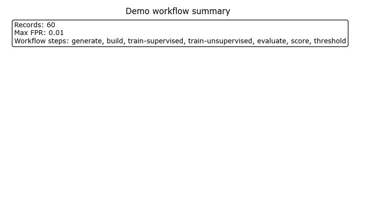
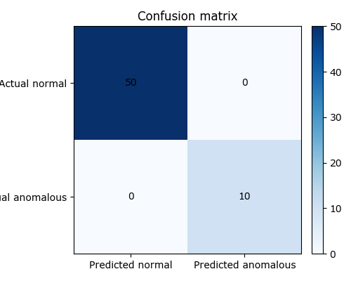
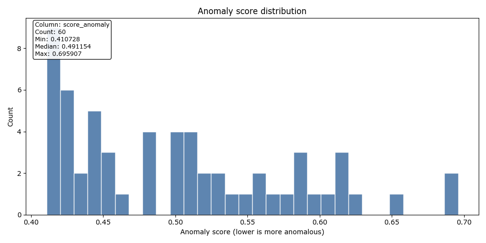

# Demo Pipeline Report: demo_20260331T221217647010Z

**Status**: `go`
**Workflow**: `demo`
**Created (UTC)**: `2026-03-31T22:12:20.857168Z`
**Runtime CLI surface**: `observerctl`

## Executive summary

Demo pipeline completed through observerctl ds.

## Run snapshot

| Field | Value |
| --- | --- |
| Run ID | demo_20260331T221217647010Z |
| Workflow | demo |
| Decision | go |
| Created UTC | 2026-03-31T22:12:20.857168Z |
| Runtime CLI surface | observerctl |

## Context

| Field | Value |
| --- | --- |
| Dataset Seed | 123 |
| Max FPR | 0.01 |
| Model Seed | 42 |
| Output Override | False |

## Result overview

| Field | Value |
| --- | --- |
| Anomaly Direction | lower-is-more-anomalous |
| Max FPR | 0.01 |
| Run Mode | demo |
| Score Column | score_anomaly |
| Total Records | 60 |

### Counts

| TP | FP | TN | FN |
| ---: | ---: | ---: | ---: |
| 10 | 0 | 50 | 0 |

### Metrics

| Metric | Value |
| --- | --- |
| F1 | 1.0 |
| FPR | 0.0 |
| Precision | 1.0 |
| Recall | 1.0 |

### Thresholding

| Field | Value |
| --- | --- |
| Actual FPR | `0.03333333333333333` |
| Algorithm | `apexlab_lower_tail_threshold` |
| Anomaly Direction | `lower-is-more-anomalous` |
| Decision | `go` |
| Flag Rule | `score <= threshold` |
| Flagged Records | `2` |
| Invalid Rows | `0` |
| Reason Codes | `[]` |
| Records Scored | `60` |
| Report JSON | `local_untracked/analysis/runs/demo/demo_20260331T221217647010Z/scoring/threshold_report.json` |
| Report MD | `local_untracked/analysis/runs/demo/demo_20260331T221217647010Z/scoring/threshold_report.md` |
| Score Column | `score_anomaly` |
| Scores CSV | `local_untracked/analysis/runs/demo/demo_20260331T221217647010Z/scoring/scores.csv` |
| Target FPR | `0.01` |
| Threshold | `0.41126669732265103` |

### Workflow steps

1. `generate`
2. `build`
3. `train-supervised`
4. `train-unsupervised`
5. `evaluate`
6. `score`
7. `threshold`
8. `visualize`

### Reason codes

- none

## Visuals

### Visual summary

| Field | Value |
| --- | --- |
| Anomaly Direction | lower-is-more-anomalous |
| Figure Count | 6 |

### Demo workflow summary

High-level summary of the demo workflow report pack.

### Confusion matrix

Confusion matrix rendered from evaluation counts.

### Metric comparison

Evaluation metric comparison bars derived from the report-pack metrics payload.

### Threshold summary

Threshold and FPR summary derived from the evaluation or threshold payload.

### Score distribution

Distribution of anomaly scores. Lower scores indicate more anomalous records.

### Threshold selection

Lower-tail threshold overlay. Scores at or below the threshold are treated as anomalous.

## Artifact index

| Artifact | Path |
| --- | --- |
| Confusion Matrix PNG | `docs/reports/ds/runs/2026/2026-03/demo_20260331T221217647010Z/figures/confusion_matrix.png` |
| Dataset Manifest | `local_untracked/analysis/runs/demo/demo_20260331T221217647010Z/dataset/dataset_manifest.json` |
| Evaluation Run JSON | `local_untracked/analysis/runs/demo/demo_20260331T221217647010Z/evaluation/run.json` |
| Evaluation Run MD | `local_untracked/analysis/runs/demo/demo_20260331T221217647010Z/evaluation/run.md` |
| Features CSV | `local_untracked/analysis/runs/demo/demo_20260331T221217647010Z/dataset/features.csv` |
| Labels CSV | `local_untracked/analysis/runs/demo/demo_20260331T221217647010Z/dataset/labels.csv` |
| Metric Comparison PNG | `docs/reports/ds/runs/2026/2026-03/demo_20260331T221217647010Z/figures/metric_comparison.png` |
| Root Dir | `local_untracked/analysis/runs/demo/demo_20260331T221217647010Z` |
| Score Distribution PNG | `docs/reports/ds/runs/2026/2026-03/demo_20260331T221217647010Z/figures/score_distribution.png` |
| Scores CSV | `local_untracked/analysis/runs/demo/demo_20260331T221217647010Z/scoring/scores.csv` |
| Supervised Model Path | `local_untracked/analysis/runs/demo/demo_20260331T221217647010Z/models/supervised/model.pkl` |
| Supervised Train Manifest | `local_untracked/analysis/runs/demo/demo_20260331T221217647010Z/models/supervised/train_manifest.json` |
| Threshold Report JSON | `local_untracked/analysis/runs/demo/demo_20260331T221217647010Z/scoring/threshold_report.json` |
| Threshold Report MD | `local_untracked/analysis/runs/demo/demo_20260331T221217647010Z/scoring/threshold_report.md` |
| Threshold Selection PNG | `docs/reports/ds/runs/2026/2026-03/demo_20260331T221217647010Z/figures/threshold_selection.png` |
| Threshold Summary PNG | `docs/reports/ds/runs/2026/2026-03/demo_20260331T221217647010Z/figures/threshold_summary.png` |
| Unsupervised Model Path | `local_untracked/analysis/runs/demo/demo_20260331T221217647010Z/models/unsupervised/model.pkl` |
| Unsupervised Train Manifest | `local_untracked/analysis/runs/demo/demo_20260331T221217647010Z/models/unsupervised/train_manifest.json` |
| Workflow Summary PNG | `docs/reports/ds/runs/2026/2026-03/demo_20260331T221217647010Z/figures/workflow_summary.png` |

## Provenance

### Source lineage

| Field | Value |
| --- | --- |
| Source Run Root | `local_untracked/analysis/runs/demo/demo_20260331T221217647010Z` |

### Source Report Paths

| Surface | Path |
| --- | --- |
| JSON | `local_untracked/analysis/runs/demo/demo_20260331T221217647010Z/report/report.json` |
| Manifest | `local_untracked/analysis/runs/demo/demo_20260331T221217647010Z/report/manifest.json` |
| Markdown | `local_untracked/analysis/runs/demo/demo_20260331T221217647010Z/report/report.md` |

## Report paths

| Surface | Path |
| --- | --- |
| JSON | `docs/reports/ds/runs/2026/2026-03/demo_20260331T221217647010Z/report.json` |
| Manifest | `docs/reports/ds/runs/2026/2026-03/demo_20260331T221217647010Z/manifest.json` |
| Markdown | `docs/reports/ds/runs/2026/2026-03/demo_20260331T221217647010Z/report.md` |
