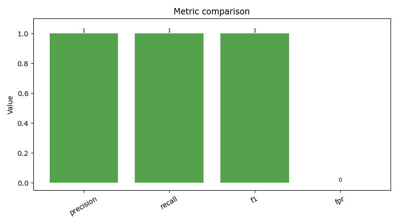
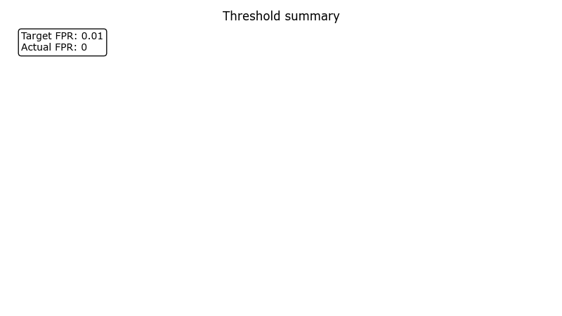
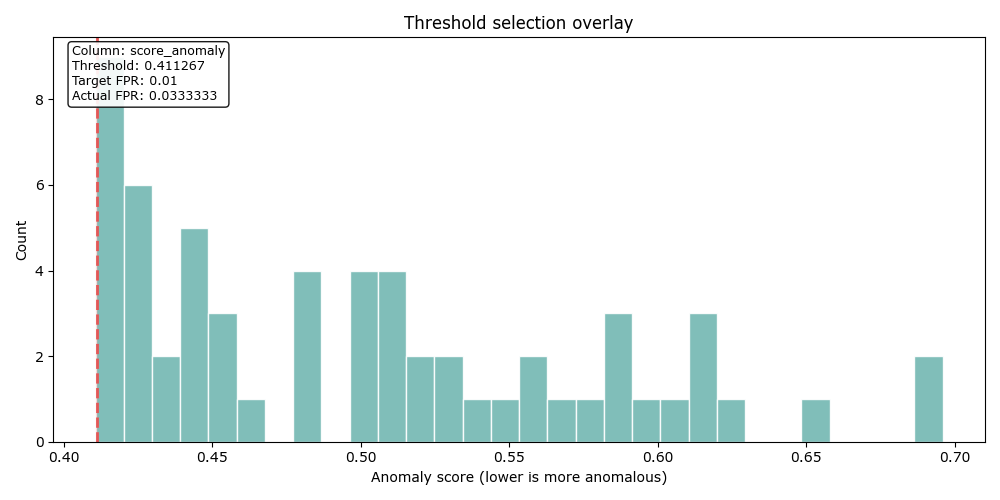

# Demo Pipeline Report: demo_20260331T221410208505Z

- Workflow: demo
- Created (UTC): 2026-03-31T22:14:12.248047Z
- Decision: go
- Summary: Demo pipeline completed through observerctl ds.

## Context

- dataset_seed: 123
- max_fpr: 0.01
- model_seed: 42
- output_override: False

## Result

- anomaly_direction: lower-is-more-anomalous
- counts:
  - fn: 0
  - fp: 0
  - tn: 50
  - tp: 10
- max_fpr: 0.01
- metrics:
  - f1: 1.0
  - fpr: 0.0
  - precision: 1.0
  - recall: 1.0
- reason_codes: []
- run_mode: demo
- score_column: score_anomaly
- thresholding:
  - actual_fpr: 0.03333333333333333
  - algorithm: apexlab_lower_tail_threshold
  - anomaly_direction: lower-is-more-anomalous
  - decision: go
  - flag_rule: score <= threshold
  - flagged_records: 2
  - invalid_rows: 0
  - reason_codes: []
  - records_scored: 60
  - report_json: local_untracked/analysis/runs/demo/demo_20260331T221410208505Z/scoring/threshold_report.json
  - report_md: local_untracked/analysis/runs/demo/demo_20260331T221410208505Z/scoring/threshold_report.md
  - score_column: score_anomaly
  - scores_csv: local_untracked/analysis/runs/demo/demo_20260331T221410208505Z/scoring/scores.csv
  - target_fpr: 0.01
  - threshold: 0.41126669732265103
- total_records: 60
- workflow_steps: ["generate", "build", "train-supervised", "train-unsupervised", "evaluate", "score", "threshold", "visualize"]

## Visuals

- Anomaly direction: lower-is-more-anomalous
- Figure count: 6

### Demo workflow summary

High-level summary of the demo workflow report pack.

### Confusion matrix

Confusion matrix rendered from evaluation counts.

### Metric comparison

Evaluation metric comparison bars derived from the report-pack metrics payload.

### Threshold summary

Threshold and FPR summary derived from the evaluation or threshold payload.

### Score distribution

Distribution of anomaly scores. Lower scores indicate more anomalous records.

### Threshold selection

Lower-tail threshold overlay. Scores at or below the threshold are treated as anomalous.

## Artifacts

- confusion_matrix_png: docs/reports/ds/runs/2026/2026-03/demo_20260331T221410208505Z/figures/confusion_matrix.png
- dataset_manifest: local_untracked/analysis/runs/demo/demo_20260331T221410208505Z/dataset/dataset_manifest.json
- evaluation_run_json: local_untracked/analysis/runs/demo/demo_20260331T221410208505Z/evaluation/run.json
- evaluation_run_md: local_untracked/analysis/runs/demo/demo_20260331T221410208505Z/evaluation/run.md
- features_csv: local_untracked/analysis/runs/demo/demo_20260331T221410208505Z/dataset/features.csv
- labels_csv: local_untracked/analysis/runs/demo/demo_20260331T221410208505Z/dataset/labels.csv
- metric_comparison_png: docs/reports/ds/runs/2026/2026-03/demo_20260331T221410208505Z/figures/metric_comparison.png
- root_dir: local_untracked/analysis/runs/demo/demo_20260331T221410208505Z
- score_distribution_png: docs/reports/ds/runs/2026/2026-03/demo_20260331T221410208505Z/figures/score_distribution.png
- scores_csv: local_untracked/analysis/runs/demo/demo_20260331T221410208505Z/scoring/scores.csv
- supervised_model_path: local_untracked/analysis/runs/demo/demo_20260331T221410208505Z/models/supervised/model.pkl
- supervised_train_manifest: local_untracked/analysis/runs/demo/demo_20260331T221410208505Z/models/supervised/train_manifest.json
- threshold_report_json: local_untracked/analysis/runs/demo/demo_20260331T221410208505Z/scoring/threshold_report.json
- threshold_report_md: local_untracked/analysis/runs/demo/demo_20260331T221410208505Z/scoring/threshold_report.md
- threshold_selection_png: docs/reports/ds/runs/2026/2026-03/demo_20260331T221410208505Z/figures/threshold_selection.png
- threshold_summary_png: docs/reports/ds/runs/2026/2026-03/demo_20260331T221410208505Z/figures/threshold_summary.png
- unsupervised_model_path: local_untracked/analysis/runs/demo/demo_20260331T221410208505Z/models/unsupervised/model.pkl
- unsupervised_train_manifest: local_untracked/analysis/runs/demo/demo_20260331T221410208505Z/models/unsupervised/train_manifest.json
- workflow_summary_png: docs/reports/ds/runs/2026/2026-03/demo_20260331T221410208505Z/figures/workflow_summary.png

## Lineage

- source_report_paths:
  - json: local_untracked/analysis/runs/demo/demo_20260331T221410208505Z/report/report.json
  - manifest: local_untracked/analysis/runs/demo/demo_20260331T221410208505Z/report/manifest.json
  - markdown: local_untracked/analysis/runs/demo/demo_20260331T221410208505Z/report/report.md
- source_run_root: local_untracked/analysis/runs/demo/demo_20260331T221410208505Z

## Report paths

- json: docs/reports/ds/runs/2026/2026-03/demo_20260331T221410208505Z/report.json
- manifest: docs/reports/ds/runs/2026/2026-03/demo_20260331T221410208505Z/manifest.json
- markdown: docs/reports/ds/runs/2026/2026-03/demo_20260331T221410208505Z/report.md
