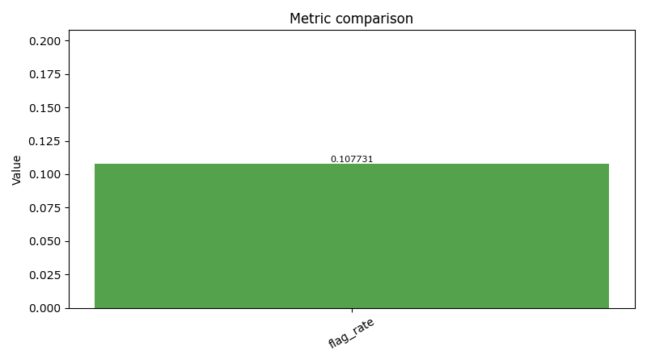
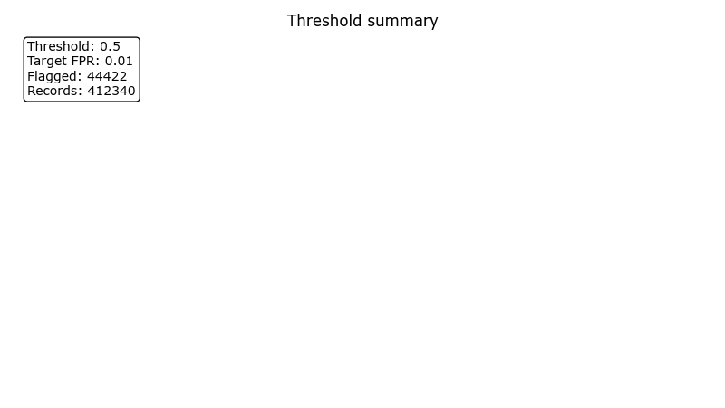

# Evaluation Report: evaluate_20260404T042518083074Z

**Status**: `go`
**Workflow**: `evaluate`
**Created (UTC)**: `2026-04-04T04:25:20.557276Z`
**Runtime CLI surface**: `observerctl`
**Command path**: `observerctl ds evaluate`

## Executive summary

Evaluation completed through observerctl ds.

## Run snapshot

| Field | Value |
| --- | --- |
| Run ID | evaluate_20260404T042518083074Z |
| Workflow | evaluate |
| Decision | go |
| Created UTC | 2026-04-04T04:25:20.557276Z |
| Runtime CLI Surface | observerctl |
| Command Path | observerctl ds evaluate |

## Context

| Field | Value |
| --- | --- |
| Max FPR | 0.01 |
| Output Override | False |

## Result overview

| Field | Value |
| --- | --- |
| Has Labels | False |
| Threshold | 0.5 |

### Counts

| Flagged | Total |
| ---: | ---: |
| 44422 | 412340 |

### Metrics

| Metric | Value |
| --- | --- |
| Flag Rate | 0.10773148372702139 |

### Reason codes

- none

## Visuals

### Visual summary

| Field | Value |
| --- | --- |
| Figure Count | 2 |

### Metric comparison

Evaluation metric comparison bars derived from the report-pack metrics payload.

### Threshold summary

Threshold and FPR summary derived from the evaluation or threshold payload.

## Artifact index

| Artifact | Path |
| --- | --- |
| Metric Comparison PNG | `docs/reports/ds/runs/2026/2026-04/evaluate_20260404T042518083074Z/figures/metric_comparison.png` |
| Run JSON | `local_untracked/analysis/runs/evaluate/evaluate_20260404T042518083074Z/evaluation/run.json` |
| Run MD | `local_untracked/analysis/runs/evaluate/evaluate_20260404T042518083074Z/evaluation/run.md` |
| Threshold Summary PNG | `docs/reports/ds/runs/2026/2026-04/evaluate_20260404T042518083074Z/figures/threshold_summary.png` |

## Provenance

### Source lineage

| Field | Value |
| --- | --- |
| Dataset Manifest | `local_untracked/analysis/runs/build/build_20260404T040910794598Z/dataset/dataset_manifest.json` |
| Features CSV | `local_untracked/analysis/runs/build/build_20260404T040910794598Z/dataset/features.csv` |
| Model Path | `local_untracked/analysis/runs/train/train_20260404T041211146010Z/model/model.pkl` |
| Source Run Root | `local_untracked/analysis/runs/evaluate/evaluate_20260404T042518083074Z` |

### Source Report Paths

| Surface | Path |
| --- | --- |
| JSON | `local_untracked/analysis/runs/evaluate/evaluate_20260404T042518083074Z/report/report.json` |
| Manifest | `local_untracked/analysis/runs/evaluate/evaluate_20260404T042518083074Z/report/manifest.json` |
| Markdown | `local_untracked/analysis/runs/evaluate/evaluate_20260404T042518083074Z/report/report.md` |

## Report paths

| Surface | Path |
| --- | --- |
| JSON | `docs/reports/ds/runs/2026/2026-04/evaluate_20260404T042518083074Z/report.json` |
| Manifest | `docs/reports/ds/runs/2026/2026-04/evaluate_20260404T042518083074Z/manifest.json` |
| Markdown | `docs/reports/ds/runs/2026/2026-04/evaluate_20260404T042518083074Z/report.md` |
