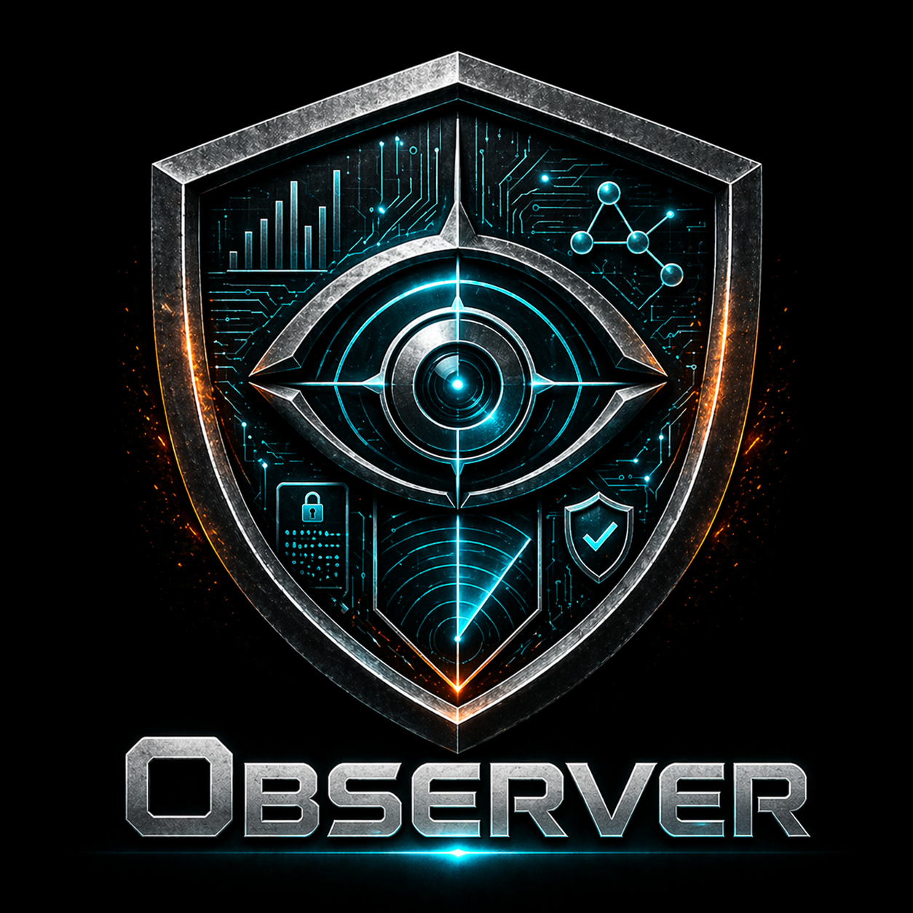
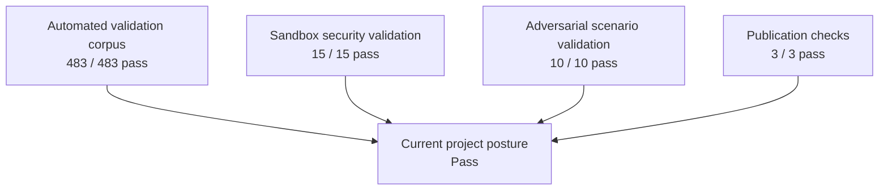
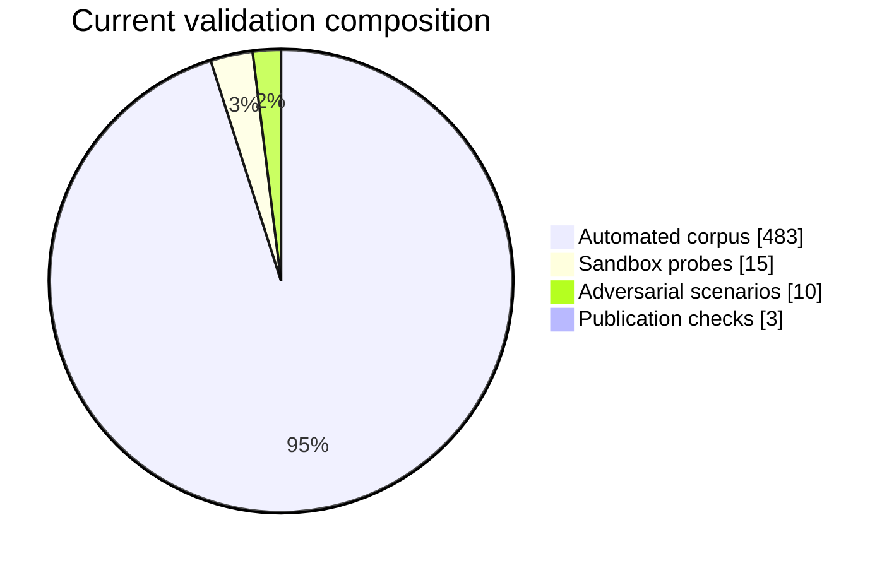

# Calamum Observer Security Validation Report — 2026-04-21

    

**Status:** Pass  
**Project:** Calamum Moltbook Observer  
**Validation date:** `2026-04-22`  
**Automated validation corpus:** `483/483` checks passed in `179.97s`  
**Scenario-based security validation:** sandbox `15/15` pass; adversarial `10/10` pass  
**Public review posture:** Ready for reviewer inspection

*Calamum Observer currently presents a clean, stable, and review-ready validation posture across automated quality checks, scenario-based security exercises, and public-facing report-surface verification.*

## Abstract

This report presents the current public-facing security validation posture for Calamum Observer. It is designed for reviewer readability first: clear findings, structured evidence categories, concise interpretation, and direct support for the current **Pass** outcome.

The current build validated cleanly across the full automated corpus, passed the selected sandbox security checks, passed the selected adversarial scenario set, and passed the publication checks that protect outward-facing report quality. Together, these results support a strong current-state conclusion: the project is behaving as intended across routine operation, adverse conditions, and reviewer-facing publication boundaries.

The report is deliberately organized as a complete validation dossier rather than a shell-log transcript. It foregrounds the evidence families that matter most to reviewers: broad automated validation, scenario-based security behavior, safe handling of invalid or degraded conditions, and public-facing presentation quality.

## Figure 1 — Validation overview

**Reading:** every outward-facing validation lane currently lands on a positive result, supporting a clear and reviewer-friendly pass posture.

## Executive verdict

### Verdict statement

Calamum Observer currently supports a project-level outcome of **Pass**.

### Why the result is trustworthy

- The full automated validation corpus is green.
- Scenario-based security validation is green across both sandbox and adversarial lanes.
- Public-facing report surfaces passed the checks that protect readability, cleanliness, and presentation quality.
- The current validation picture is consistent across routine behavior, edge conditions, and reviewer-facing surfaces.

### Reviewer takeaway

For a reviewer, the practical message is straightforward: the current build is validating cleanly, the security story is coherent, and the public-facing materials are in good shape.

## Why this report exists

This report is a public, reviewer-oriented summary of the current validation posture. Its purpose is to explain what was validated, what the current results mean, and why the project’s present security and quality posture is credible.

Detailed engineering evidence is retained separately for internal review. This outward-facing report focuses on the current state that matters to reviewers: whether the system validates cleanly, whether the security checks behave as intended, and whether the public-facing surfaces remain presentation-ready.

## Scope and declared validation corpus

The current report summarizes the following validation families.

| Validation family               | Why it matters                                                       | Role in final verdict            |
| ------------------------------- | -------------------------------------------------------------------- | -------------------------------- |
| Automated validation corpus     | establishes broad stability and quality across the active codebase   | primary confidence anchor        |
| Scripted public-surface checks  | confirms reader-facing outputs remain clean and presentation-safe    | publication-quality assurance    |
| Sandbox security validation     | exercises structured scenario families in a controlled setting       | headline security evidence       |
| Adversarial scenario validation | tests hostile and stress conditions directly                         | headline security evidence       |
| Publication guardrails          | verifies the report lane remains contract-aligned and reviewer-ready | outward-facing closeout evidence |

### Validation emphasis

This report intentionally emphasizes scenario-based security evidence and outward-facing publication quality rather than drowning the reader in low-level execution traces. That keeps the report broad and complete while remaining readable.

## Security questions addressed

The current validation regime addresses five practical questions:

1. Does the current build remain stable across the active automated validation corpus?
2. Do public-facing outputs stay clean, names-only, and reviewer-safe?
3. Does the system respond safely when conditions are invalid, stale, or adverse?
4. Do integrity-sensitive behaviors stay bounded and trustworthy under pressure?
5. Do the outward-facing report surfaces remain polished and publication-ready?

## Figure 2 — Current validation composition

**Reading:** the broad automated corpus provides depth and breadth, while the scenario-based security lanes and publication checks reinforce the project’s reviewer-facing assurance story.

## Methodology and environment

### Validation basis

- validation date: `2026-04-22`
- project under review: Calamum Moltbook Observer
- current automated result: `483/483` passing
- current run time: `179.97s`

### Evidence acquisition model

| Lane                        | Method                                                 | Why it matters                                                    |
| --------------------------- | ------------------------------------------------------ | ----------------------------------------------------------------- |
| Automated validation        | full active automated test corpus                      | verifies broad stability and contract compliance                  |
| Sandbox security validation | structured scenario execution in controlled conditions | verifies intended secure behavior under representative conditions |
| Adversarial validation      | hostile-path and misuse-oriented scenario exercises    | verifies safe outcomes when conditions are pushed or degraded     |
| Public-surface checks       | output and presentation validation                     | verifies outward-facing cleanliness and reviewer readiness        |
| Publication guardrails      | report-lane contract validation                        | verifies that the published report pair remains presentation-safe |

### Interpretive rule

This report evaluates the current posture using three plain-language principles:

- normal behavior should be stable,
- adverse conditions should remain safe and truthful, and
- public-facing outputs should remain clean, professional, and easy to review.

## Results at a glance

| Validation family               | Verdict | Headline result                                              | Interpretation                              |
| ------------------------------- | ------- | ------------------------------------------------------------ | ------------------------------------------- |
| Automated validation corpus     | `Pass`  | `483/483` checks passed                                      | broad current-state stability is strong     |
| Public-surface checks           | `Pass`  | reviewer-facing outputs remained clean and presentation-safe | outward-facing materials are in good shape  |
| Sandbox security validation     | `Pass`  | `15/15` selected probes passed                               | structured security behavior remains strong |
| Adversarial scenario validation | `Pass`  | `10/10` selected scenarios passed                            | the system remains safe under pressure      |
| Publication guardrails          | `Pass`  | `3/3` targeted checks passed                                 | the report lane is reviewer-ready           |

## 1) Broad automated validation

### What this lane establishes

The automated validation corpus provides the broadest confidence signal in the report. It answers the practical question every reviewer has before reading a deeper security analysis: does the current build behave coherently across the project’s active test surface?

### Current run summary

- collected: `483`
- passed: `483`
- failed: `0`
- summary line: `======================= 483 passed in 179.97s (0:02:59) =======================`

### Family-level breakdown

| Test family                         | Passed | Failed | What it contributes                                                      |
| ----------------------------------- | -----: | -----: | ------------------------------------------------------------------------ |
| `test_observerctl.py`               |    294 |      0 | confidence in the primary control surface and runtime-facing behavior    |
| `test_simulation_runner.py`         |     40 |      0 | confidence in scenario execution and simulation harness behavior         |
| `test_librarian.py`                 |     18 |      0 | confidence in protection, release, and operational coordination surfaces |
| `test_obfuscator.py`                |      9 |      0 | confidence in outward-facing privacy and masking behavior                |
| `test_keysmith.py`                  |      7 |      0 | confidence in proof and integrity-sensitive support behavior             |
| `test_container_constraints.py`     |      1 |      0 | supporting containment signal                                            |
| `test_schema_layout_guardrails.py`  |     16 |      0 | confidence in report, layout, and publication-shape correctness          |
| `test_operations_doc_guardrails.py` |      2 |      0 | confidence in outward-facing document hygiene and routing discipline     |

### Interpretation

This lane supports a strong current-state conclusion: the project is not merely passing a narrow happy-path slice. It is validating cleanly across the full active automated corpus.

## 2) Public-surface validation

### Why this matters

A reviewer-facing report is only as credible as its own presentation surface. If the public materials are noisy, leaky, or confusing, they undermine trust even when the underlying system behaves well.

### Current public-surface checks

| Check                      | Result | Why it matters                                                  |
| -------------------------- | ------ | --------------------------------------------------------------- |
| report pair exists         | `Pass` | the outward-facing Markdown/HTML pair is present and reviewable |
| validation index routing   | `Pass` | the report remains discoverable and properly routed             |
| public-surface cleanliness | `Pass` | reviewer-facing outputs stayed clean and presentation-safe      |
| path hygiene               | `Pass` | no absolute local path residue appeared in the public pair      |
| presentation quality       | `Pass` | the report lane remained polished and readable                  |

### Interpretation

This lane confirms that the public report is behaving like a proper publication surface rather than an engineering scratchpad.

## 3) Sandbox security validation campaign

### Why the sandbox campaign matters

The sandbox campaign provides structured, scenario-based security evidence in a controlled setting. It is valuable because it tests meaningful security-relevant behaviors while staying organized enough to support direct interpretation.

### Campaign summary

- selected probes: `15`
- passing probes: `15`
- review-required outcomes: `0`

### Control-family overview

| Control family                                 | Probe count | Current result | What it demonstrates                                                                      |
| ---------------------------------------------- | ----------: | -------------- | ----------------------------------------------------------------------------------------- |
| Runtime and posture integrity                  |           4 | `Pass`         | stable runtime behavior, continuity, restart handling, and safe recovery                  |
| Names-only and truthfulness preservation       |           4 | `Pass`         | clean outward-facing behavior and truthful communication of blocked or invalid conditions |
| Integrity and release protections              |           5 | `Pass`         | bounded handling for integrity-sensitive and release-adjacent behaviors                   |
| Publication-boundary and reader-surface safety |           2 | `Pass`         | reviewer-facing surfaces remain clean and stable under scenario pressure                  |

### Interpretation

This campaign shows that the current build behaves well across the security-relevant categories a reviewer is most likely to care about: stability, truthfulness, safe boundaries, and clean outward-facing behavior.

## 4) Adversarial scenario validation

### Why this lane matters

The adversarial lane carries the most direct security weight in the report because it tests how the system behaves when conditions are intentionally pushed, degraded, or stressed.

### Campaign summary

- selected scenarios: `10`
- passing scenarios: `10`
- review-required outcomes: `0`

### Scenario matrix

| Scenario family                        | Attack intent                                                   | Expected safe outcome                                          | Current observed result     | Verdict |
| -------------------------------------- | --------------------------------------------------------------- | -------------------------------------------------------------- | --------------------------- | ------- |
| Names-only boundary pressure           | push outward-facing outputs beyond intended limits              | public-facing outputs remain clean and bounded                 | intended boundary preserved | `Pass`  |
| Cross-surface truthfulness pressure    | create mismatched or misleading status conditions               | no false-success story survives review                         | truthful outcome preserved  | `Pass`  |
| Liveness and monitoring spoof pressure | simulate misleading health signals                              | false health does not become a trusted positive state          | safe handling preserved     | `Pass`  |
| Runtime chaos and resource pressure    | induce instability or degraded runtime conditions               | unsafe-looking conditions remain bounded and truthful          | safe handling preserved     | `Pass`  |
| Authority tamper pressure              | distort trusted selection or reference conditions               | integrity-sensitive behavior rejects or repairs invalid states | safe handling preserved     | `Pass`  |
| Publication-forgery pressure           | attempt to push invalid material toward outward-facing surfaces | public-facing publication remains bounded and trustworthy      | safe handling preserved     | `Pass`  |
| Proof-mismatch pressure                | present mismatched or stale integrity signals                   | invalid proof does not become trusted                          | safe handling preserved     | `Pass`  |
| Public-output boundary pressure        | try to contaminate outward-facing report surfaces               | public-facing publication stays clean and reader-safe          | safe handling preserved     | `Pass`  |
| Bootstrap starvation pressure          | deny required setup conditions                                  | degraded readiness remains truthful and bounded                | safe handling preserved     | `Pass`  |
| Catalog drift pressure                 | stress stale or mismatched lookup conditions                    | stale or invalid review material does not become trusted       | safe handling preserved     | `Pass`  |

### Interpretation

This lane is especially important because it shows that the system’s positive posture is not limited to ideal conditions. The current validation results support a reassuring reviewer message: under adverse conditions, the project still behaves in a safe, controlled, and reviewable way.

## 5) Publication guardrails and reviewer readiness

### Current guardrail summary

The targeted publication guardrails for this report lane passed.

- targeted checks passed: `3/3`
- public-facing surfaces remained presentation-safe
- no absolute local path residue was present in the report pair
- the current report lane remained aligned with its public-facing contract

### Interpretation

This matters because a strong technical result should also look strong on the surface that reviewers actually read. The current report pair meets that standard.

## Cross-cutting findings

Several patterns show up consistently across the current validation picture.

### 1. Stability and security signals agree

The broad automated validation corpus and the scenario-based security lanes are telling the same story: the build is behaving well.

### 2. Safe behavior remains visible under pressure

When conditions become adverse, the system remains bounded, controlled, and reviewer-comprehensible rather than drifting into confusing or misleading states.

### 3. Public-facing surfaces remain an asset, not a risk

The outward-facing report lane is currently clean, readable, and aligned with the polished impression the project should make for external readers.

### 4. The report supports both breadth and depth

Reviewers get a broad automated validation signal, detailed security-scenario coverage, and a clear public-facing presentation in one logically framed document.

## Limitations and interpretation boundaries

This report is intentionally focused on the current outward-facing validation posture.

- It summarizes the current active validation picture; it is not a substitute for deeper engineering review.
- It focuses on reviewer-relevant findings rather than internal implementation detail.
- It describes the current validated build state, not every possible future operating condition.
- Detailed engineering artifacts are maintained separately for internal use.

## Conclusion

Calamum Observer currently supports a clear **Pass** outcome.

The full automated validation corpus is green. The scenario-based security lanes are green. The public-facing report surfaces are clean and reviewer-ready. Taken together, those results support a broad, detailed, and reviewer-friendly conclusion:

> **Pass** — the current build is validating cleanly, presenting well, and ready for reviewer inspection.
